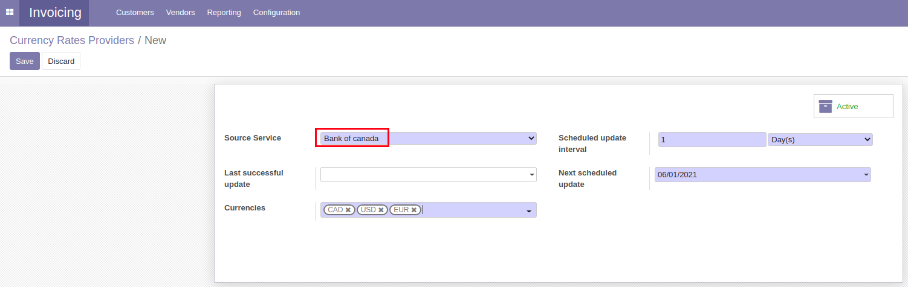
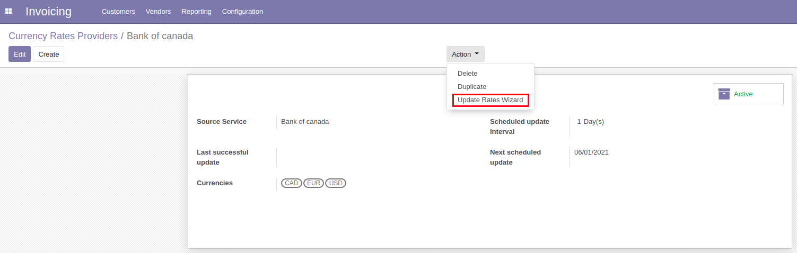

Currency Rate Update Bank of Canada
=====================================
This module adds the Bank of Canada to the exchange rate providers.

.. contents:: Table of Contents

Usage
-----
You can create an exchange rate provider using Bank of Canada's data.

You can then update the exchange rates using Bank of Canada's data.

Configuration
-------------
No configuration is required after installation.

Contributors
------------
* Numigi (tm) and all its contributors (https://bit.ly/numigiens)

More information
----------------
* Meet us at https://bit.ly/numigi-com