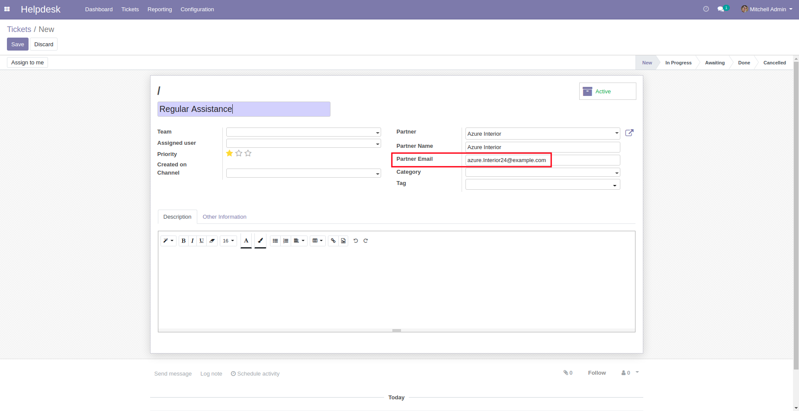
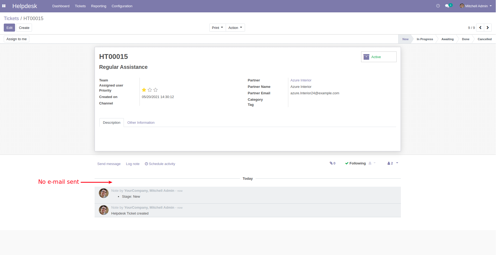

Helpdesk Management No Mail
===========================
This module prevents emails from being sent to partners related to a ticket after its creation.

.. contents:: Table of Contents

Usage
-----------
When you create a ticket, you can specify a partner e-mail address.

After creating the ticket, no confirmation e-mail will be sent to the partner regardless of whether or not an e-mail address is specified.

Configuration
-------------

No configuration required apart from module installation.

Contributors
------------
* Numigi (tm) and all its contributors (https://bit.ly/numigiens)

More information
----------------
* Meet us at https://bit.ly/numigi-com
