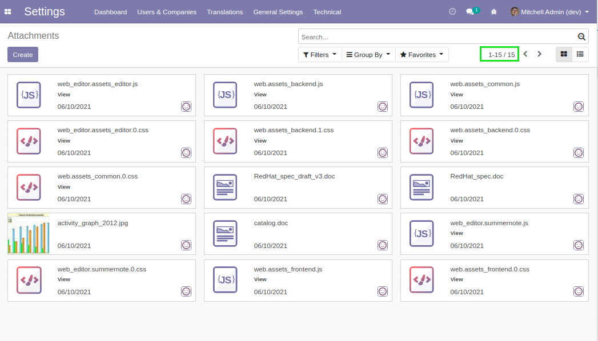
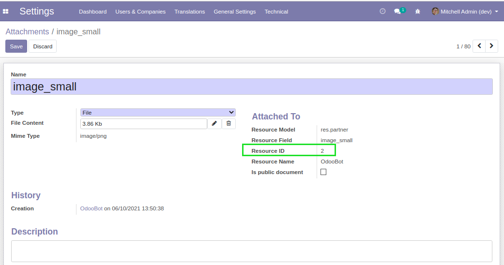
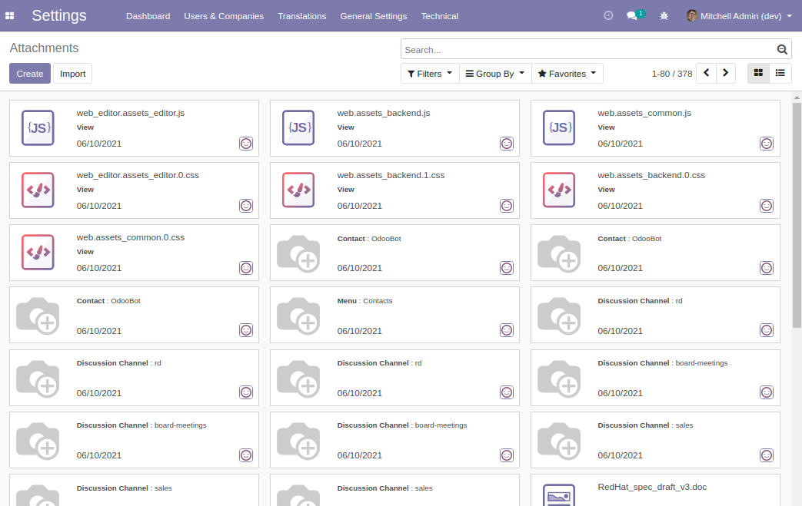
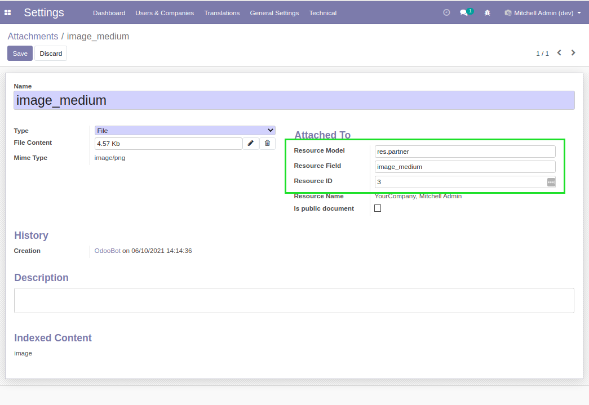

Ir Attachment Resource Editable
===============================

.. contents:: Table of Contents

Context
-------
In vanilla Odoo, attachments bound to a field (including images) are hidden in the list view of attachments.

If you add a custom filter ``Resource Field is set``, these attachments appear.

.. image:: static/description/field_attachments_only.png

However, you may not edit the ``Resource ID``.

This prevents you from moving an image from a record to another.

Usage
-----
After installing this module, I go to the list view of attachments.

I notice that attachments bound to a field are displayed.

In form view, I can edit the ``Resource ID``.

Contributors
------------
* Numigi (tm) and all its contributors (https://bit.ly/numigiens)
