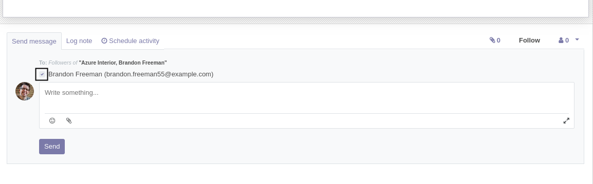

Mail Recipient Unchecked
========================
In vanilla Odoo, the mail recipient checkbox is checked by default.

With this module installed, the checkbox is unchecked by default.

Contributors
------------
* Numigi (tm) and all its contributors (https://bit.ly/numigiens)
