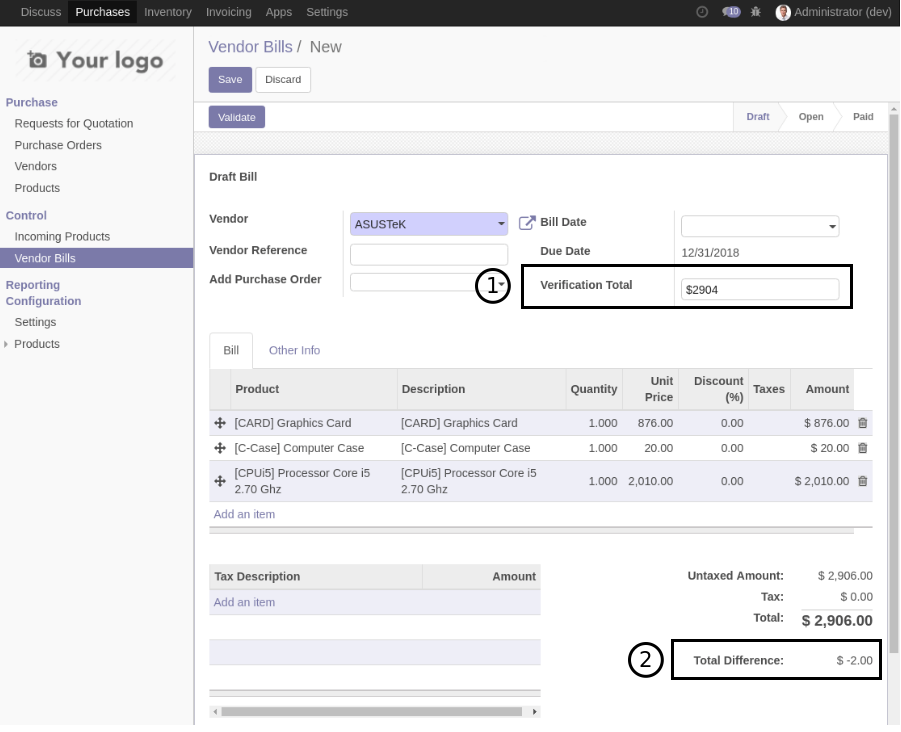
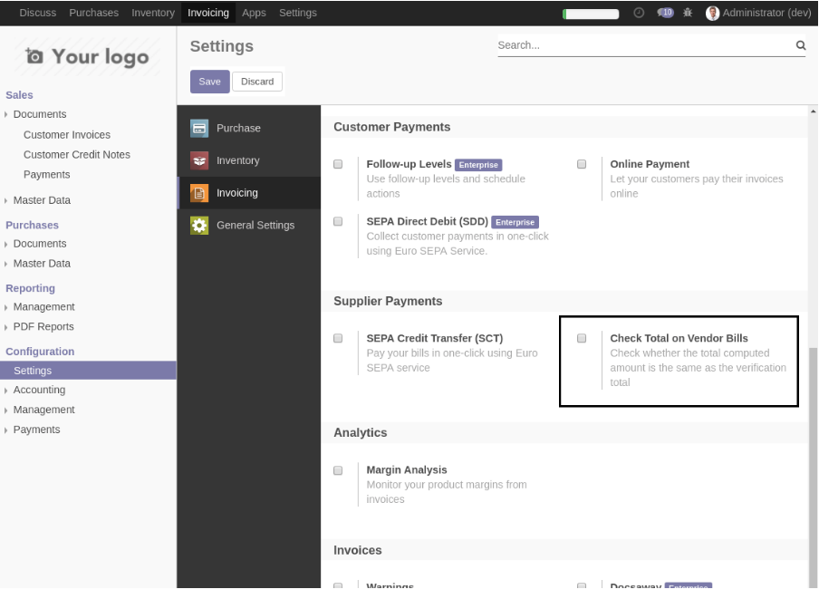

NumiPack - Accounting
=====================
This module installs all modules required on every projects that use the accounting app.

* `Account Bank Menu <https://github.com/Numigi/odoo-account-addons/tree/12.0/account_bank_menu>`_
* `Account Check Printing Aeroo <https://github.com/Numigi/aeroo_reports/tree/12.0/account_check_printing_aeroo>`_
* `Account Invoice Check Total`_
* `Account Move Chatter <https://github.com/Numigi/odoo-account-addons/tree/12.0/account_move_chatter>`_
* `Account Negative Debit Credit <https://github.com/Numigi/odoo-account-addons/tree/12.0/account_negative_debit_credit>`_
* `Invoice Currency Validation <https://github.com/Numigi/odoo-account-addons/tree/12.0/invoice_currency_validation>`_

_`Account Invoice Check Total`
------------------------------
This module is from `OCA <https://github.com/oca/account-invoicing/tree/12.0/account_invoice_check_total>`_.

(1) It adds a field to enter the total amount written on the supplier invoice.
(2) The difference between the total on the invoice and computed in Odoo is displayed.

By default, the feature is hidden.
To activate it, you must fo to the settings of the accounting app and check the following box:

Contributors
------------
* Numigi (tm) and all its contributors (https://bit.ly/numigiens)

More information
----------------
* Meet us at https://bit.ly/numigi-com
