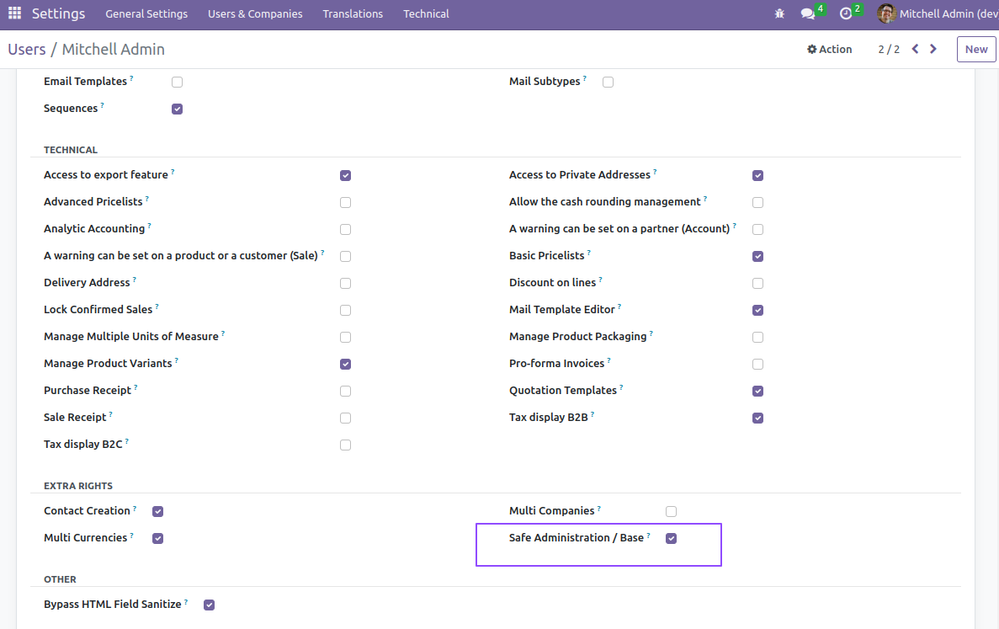
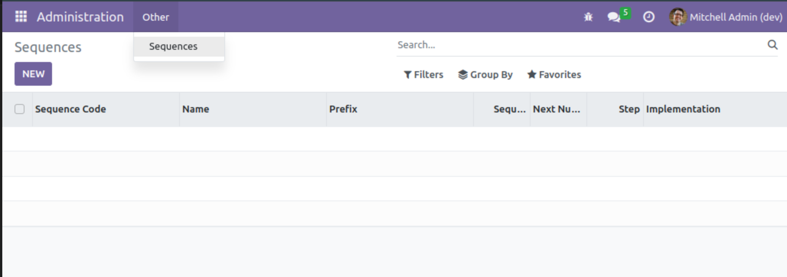

Admin Light
===========
This module adds a new `Administration` menu with restricted functionalities.

The purpose of this module is to give partial administration access to the client.
This helps prevent manipulation errors and simplifies the navigation for the administrator.

This module adds the new application without any content.
Specific modules add the functionalities to the application.

Functionalities are added on an `ad hoc` basis, based on the trainings completed by the client.
Each functionnality is added by a specific user group.

The group `Safe Administration / Base` is added by this module to grant access to the Administration application.
This group requires developper mode to be displayed under the section `Extra Rights`.

The section `Safe Administartion` requires developper mode to be displayed.

Sequences
---------
A new group `Safe Administration / Sequences` is added.

This group has access to create and edit sequences.

Contributors
------------
* Numigi (tm) and all its contributors (https://bit.ly/numigiens)

More information
----------------
* Meet us at https://bit.ly/numigi-com
