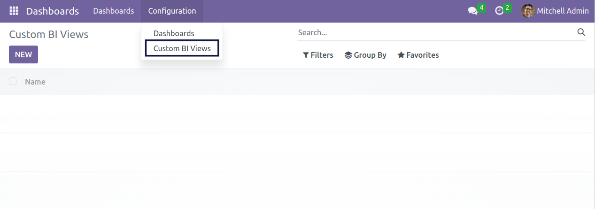
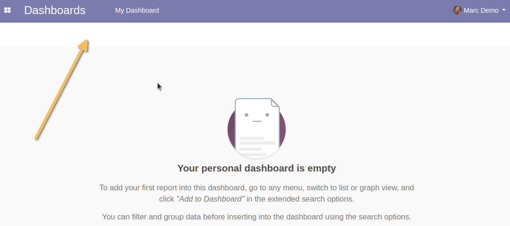

Admin Light BI View Editor
==========================
This module restricts access to the menu entry of the ``bi_view_editor`` module to all users 
except ``Admin Light / Base`` and ``Administration / Configuration`` users.

Usage
-----
Access
~~~~~~
As a user in the ``Administration / Configuration`` or ``Admin Light / Base`` user group, 
I go to the ``Dashboard`` application.

I see that I have access to the ``Custom BI Views`` menu entry.

If I do a search in the search bar on the App panel (if the feature is available like on Enterprise Edition of Odoo), I see the menu.

No access
~~~~~~~~~
As a user not part of the ``Administration / Configuration`` or ``Admin Light / Base`` user group, 
I go to the ``Dashboard`` application.

I see that I don't have access to the ``Custom Bi Views`` menu entry.

Even if I do a search in the search bar on the App panel (if the feature is available like on Enterprise Edition of Odoo), I don't see the menu.

Contributors
------------
* Numigi (tm) and all its contributors (https://bit.ly/numigiens)

More information
----------------
* Meet us at https://bit.ly/numigi-com
