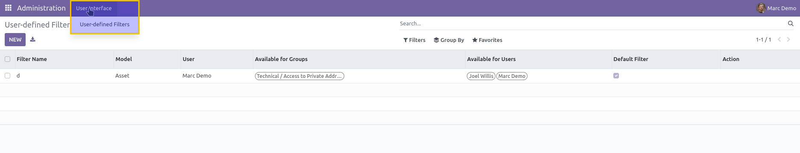

=====================
Admin Light Filters
=====================

This module introduces user-defined filter management within the Admin Light application.

**Table of contents**

.. contents::
   :local:

Overview
========

The `Admin Light Filters` module adds functionality for managing filters by users in the Admin Light interface. It introduces a new group that allows non-admin users to manage custom filters under certain conditions.

User Filter Management
=======================

A new group, **Safe Administration / Custom Filters**, is added. Members of this group who are normal users (i.e., not the default admin) can manage filters according to specific rules.

As a member of this group, under the menu **Administration > User Interface > User-defined Filters**, you can:

- **Delete** filters where:
  - The **Owner** field is empty.
  - The **Owner** field contains your user.
  
- **Modify** filters where:
  - The **Owner** field is empty.
  - The **Owner** field contains your user.

- **Access** the **Groups** and **Users** fields to share filters with specific users or groups.

Contributors
============

* Numigi (tm) and all its contributors (https://bit.ly/numigiens)

More information
================

* Meet us at https://bit.ly/numigi-com
