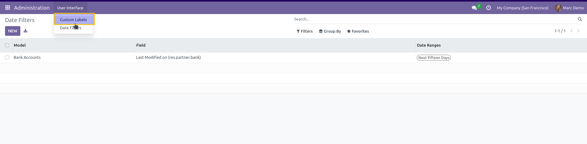
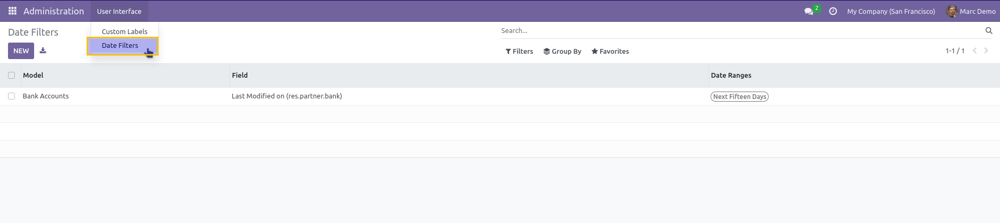

===============
Admin Light Web
===============

This module enhances the Admin Light application by adding customization options to the user interface.

Custom Labels
-------------

A new user group called `Safe Administration / Custom Labels` has been introduced. This group has access to a new menu:

* **Administration > User Interface > Custom Labels**

Members of this group can manage and edit the list of custom labels for the application, giving them flexibility to tailor label names according to their needs.

Date Filters
------------

A new user group called `Safe Administration / Date Filters` has also been introduced. This group has access to a new menu:

* **Administration > User Interface > Date Filters**

Members of this group can manage and edit the list of custom date filters, allowing administrators to create and modify date filters that suit the specific reporting requirements.

Contributors
------------

* Numigi (tm) and all its contributors (https://bit.ly/numigiens)

More Information
----------------

* Meet us at https://bit.ly/numigi-com