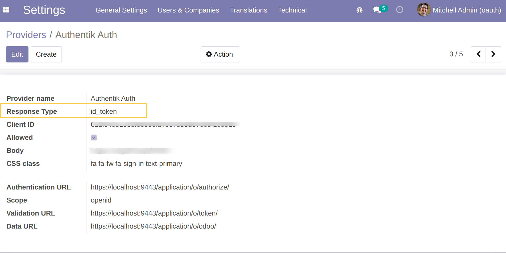

Auth Oauth Authentik
====================
This module adds compatibility between the Authentik SSO and the vanilla Oauth feature of Odoo.

.. contents:: Table of Contents

Context
-------
As of Odoo version 14.0, the Response Type 'token' is forced in the code and it's not supported by Authentik
According to Authentik OpenId configuration, the response types supported are:
* "code"
* "id_token",
* "id_token token",
* "code token",
* "code id_token",
* "code id_token token"

Overview
--------
This module adds a new field in provider form view to set the response type authorized by Authentik OpenId configuration.
If this value is set, its override the default value of odoo vanilla which is 'token'

Contributors
------------
* Numigi (tm) and all its contributors (https://bit.ly/numigiens)
