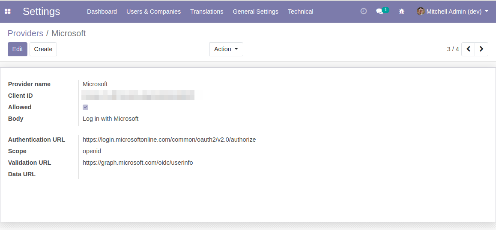
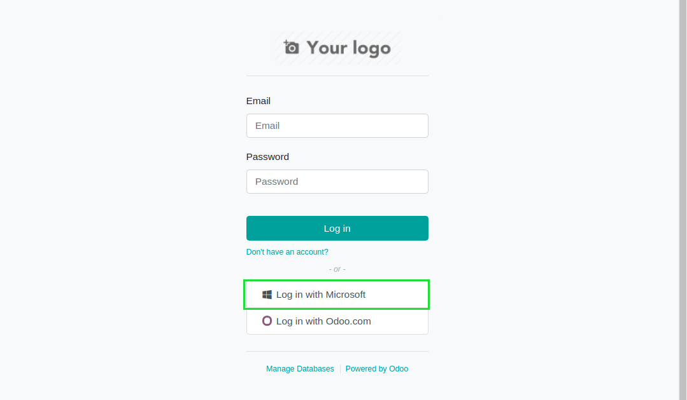

Auth Oauth Microsoft
====================
This module adds compatibility between the Microsoft SSO and the vanilla Oauth feature of Odoo.

.. contents:: Table of Contents

Context
-------
As of Odoo version 14.0, the Oauth feature is incompatible with Microsoft.

If you create an Oauth provider similarly to the predefined configurations for Google or Facebook,
you will end up with errors when authentifying.

Overview
--------
This module adds a predefined Oauth provider for Microsoft.

Behind the scene, when logging with this provider, the Oauth flow is tweeked a little bit.

If you manually create a new provider with different parameters for Microsoft, it should also work.

Contributors
------------
* Numigi (tm) and all its contributors (https://bit.ly/numigiens)

More information
----------------
* Meet us at https://bit.ly/numigi-com