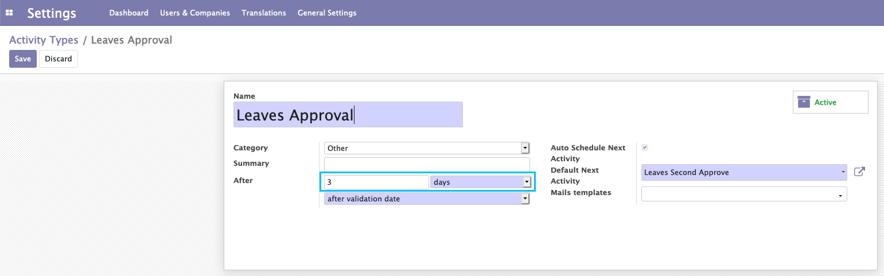
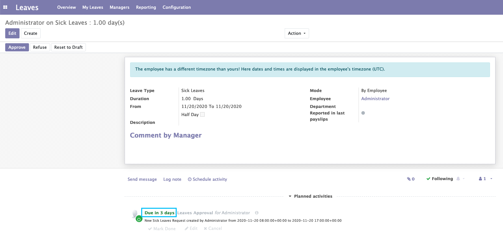

Automatic Activity Deadlines
============================
This module adds the facility to configure the delay to the deadline for scheduled activities created automatically by
the system

This behavior of calculating the deadline for automated system scheduled activities is applied in all applications.

Usage
-----
- To demonstrate, I install module Leaves
- As an administrator, I go to Settings > Technical > Emails > Activity Types menu.
- I update the delay of Sick Leaves to 3 days.

- I create a new leave request with Sick Leaves type and save.
- I see a scheduled activity is created as expected. But I see the deadline for the created activity is the next three days instead of today

Configuration
-------------
Only models which inherit mail.activity.mixin and use activity_schedule() to create automated activities are affected.

Contributors
------------
* Numigi (tm) and all its contributors (https://bit.ly/numigiens)
* Komit (https://komit-consulting.com)

More information
----------------
* Meet us at https://bit.ly/numigi-com
