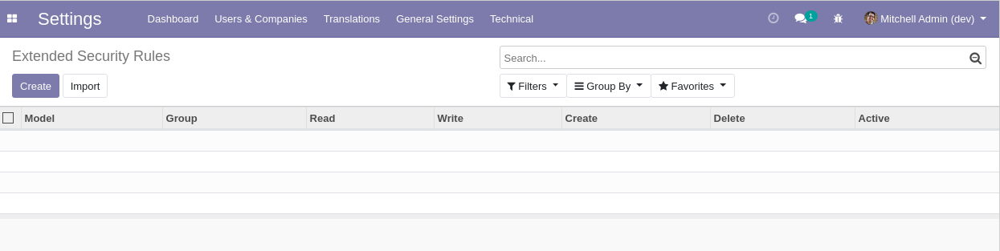
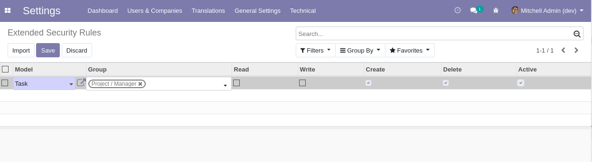
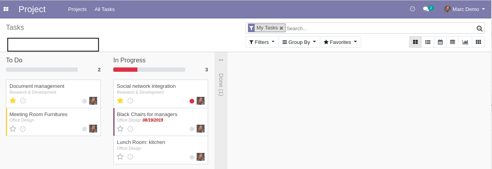
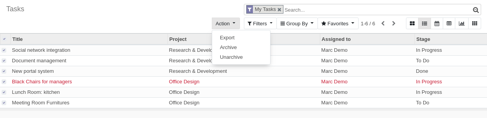
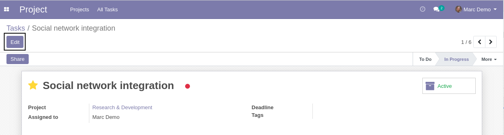

Base Extended Security
======================
Allow to define extra security for accessing records through web requests.

.. contents:: Table of Contents

Context
-------
Access rules in Odoo are light.

For example, users with basic rights can view the whole general ledger.
The user only needs to know the correct URL to the list view.

Adding extra access rules to standard Odoo models (res.partner, account.move, stock.move, etc) is risky.
You may end up with unexpected side effects.
Users with basic access will likely encounter error messages when saving records or clicking on action buttons. 

Summary
-------
This module adds access rules that are evaluated at the rpc controller level (instead of the orm level).

Architecture Overview
---------------------
The following methods are added to all models:

* get_extended_security_domain
* check_extended_security_all
* check_extended_security_read
* check_extended_security_write
* check_extended_security_create
* check_extended_security_unlink

These methods act as hooks for injecting search domains and access rights.
By inheriting one of these methods, a module can define custom security rules for a given model.

The module extends the following http routes:

* /web/dataset/call
* /web/dataset/call_kw
* /web/dataset/search_read

The hooks are injected to these routes by the module.

Writing Custom Security Modules
-------------------------------
Suppose that in a specific module, we implement security rules for invoices.

In our scenario, only members of the group ``Purchase / User`` are allowed to access vendor bills.

.. code-block:: python

    from odoo import models, _
    from odoo.exceptions import AccessError
    from odoo.osv.expression import AND

    class Invoice(models.Model):

        _inherit = 'account.invoice'

        def get_extended_security_domain(self):
            result = super().get_extended_security_domain()

            if not self.env.user.has_group('purchase.group_purchase_user'):
                result = AND(result, [('type', 'not in', ('in_invoice', 'in_refunc'))])

            return result

        def check_extended_security_all(self):
            super().get_extended_security_domain()

            supplier_bills = self.filtered(lambda i: i.type in ('in_invoice', 'in_refunc'))

            if supplier_bills and not self.env.user.has_group('purchase.group_purchase_user'):
                raise AccessError(_('You are not allowed to access vendor bills.'))

In this example, if the user is not member of ``Purchase / User``, the invoices of type ``Vendor Bill`` or ``Vendor Refund`` will be masked.

If the user attempts to access the record in read/write/create/delete mode, he will be blocked as well.

However, the module does not presume that the user is allowed or not to access customer invoices.
This is where the approach of this module makes the code easier to reason about than
the native access rules (ir.rule).

Defining Basic Rules
--------------------
This section explains how to setup basic security rules directly through the web interface.

This feature was added in version ``1.1.0`` of the module.
It uses the assets defined in the module and generalizes a way to add simple RWCD rules.

As administrator, I go to ``Settings / Technical / Security / Extended Security Rules``.

I add a new rule so that only project managers may create or delete tasks.

As member of ``Project / User``, I go to the kanban view of tasks.

I notice that I can not create a task.

I can neither delete a task.

However, I can edit existing tasks.

Action Buttons
--------------
When a user has only read access to a given model because of a `Basic Rule <#defining-basic-rules>`_,
the action buttons on the form view are hidden.

This feature is only esthetic.
It does not prevent users from actually calling a method through xml-rpc
(extended security rules only block CRUD operations).

The reason is that there are a lot of method possibily called from the web interface,
even when accessing an object in read mode.
It would be very risky to block method calls arbitrarily.

Read Access Buttons
~~~~~~~~~~~~~~~~~~~
There is a hook defined by the module that allows to define methods that are
considered ``Read`` access actions.

The buttons bound to these actions are made visible through the web interface even
though the user has read access to the model.

.. code-block:: python

    class SaleOrder(models.Model):

        _inherit = 'sale.order'

        @api.model
        def get_read_access_actions(self):
            res = super().get_read_access_actions()
            res.append("action_draft")
            return res

However, if the native Odoo ACL (``ir.model.access``) prevent the user from seeing the button,
this hook will have no effect.

Excluded Queries
----------------
The module ignores some xml-rpc queries.
The extra security rules are not checked against these queries.

Name Get
~~~~~~~~
The module ignores name_get queries.

Blocking a name_get query could raise errors related to many2one fields.

Many2many Tags
~~~~~~~~~~~~~~
Many2many tags fields in Odoo use a separate ``read`` query to render their content.

This ``read`` query contains at most 2 fields ``display_name`` and ``color``.
The module does not check security rules for such query.

It is equivalent to a ``name_get`` query.

Contributors
------------
* Numigi (tm) and all its contributors (https://bit.ly/numigiens)
