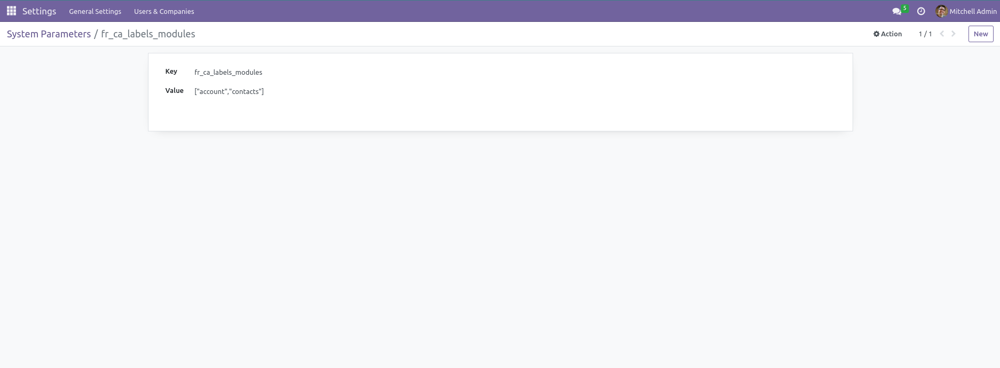
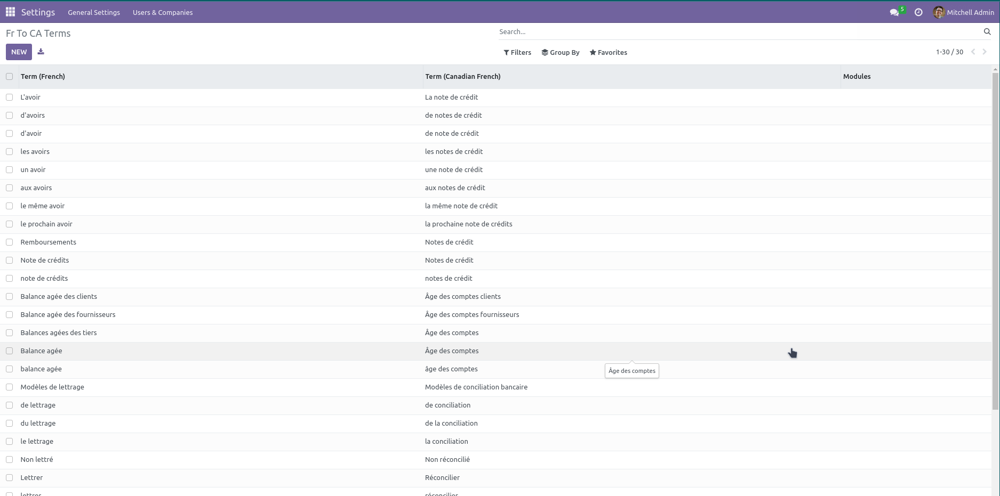
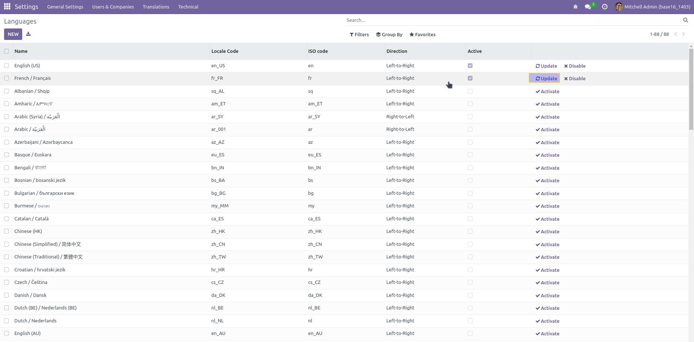

Base French Labels
==================
This module allows changing the translations of various terms from European French to Canadian French.

Odoo's French terms are primarily European, but in Quebec, some important terms differ, especially in accounting. This can lead to confusion for users.

Here is an overview of the changed terms:

* Avoir -> Note de crédit
* Balance âgée -> Âge des comptes
* Lettrage -> Conciliation bancaire

The challenge with these translations is that they appear hundreds of times in Odoo PO files across different modules. Updating and maintaining each of these translations manually would require significant and ongoing effort.

Only translations for modules listed in the system parameter `fr_ca_labels_modules` will be applied. If a module's name is not in this parameter, its terms will not be translated.

How to Update a Term
----------------------
To modify a term, navigate to:

Settings > Translations > CA Terms

Add the term in French and its corresponding Canadian French translation.

If new data is added to fr_ca_labels or the system parameter for the module list is modified, simply go to Settings > Translations > Languages and refresh the translations to apply the changes.

Contributors
------------
* Numigi (tm) and all its contributors (https://bit.ly/numigiens)