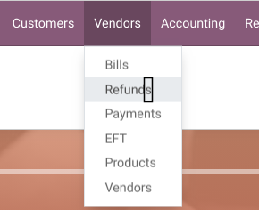
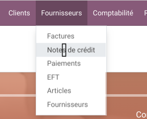

===============================
Canada French Accounting Labels
===============================

Context
=======
Odoo's default French terms are based on European terminology. In Quebec and Canada, some important accounting terms are significantly different, which can lead to confusion for local users. 

The issue with these translations is that they appear hundreds of times in Odoo PO files across different modules. Updating and maintaining each of these translations manually would require a major and constant effort.

Description
===========
This module sanitizes and automatically adapts the labels of the accounting application for the French Canada (fr_CA) language. 

Here is an overview of the main terminology changes applied by this module:
* Avoir -> Note de crédit
* Balance âgée -> Âge des comptes
* Lettrage -> Conciliation bancaire

Translations to update can be as specific as the following: "Compte utilisé sur les lignes de taxes des avoirs. Laissez vide pour utiliser le compte de dépenses."

Usage
=====
To use this module and trigger the translation replacements:

1. Navigate to **Accounting / Configuration / CA Accounting Terms**.
2. Add, edit, or remove the specific French to Canadian French term mappings.
3. Click the **"Apply translation"** button located in the header of the list view to apply changes across all installed modules.

Screenshots
===========

Menu Items Adjustments
----------------------
The missing `s` is added to the menu item `Accounting / Vendors / Refund`.

Contributors
============
* Numigi (tm) and all its contributors (https://bit.ly/numigiens)