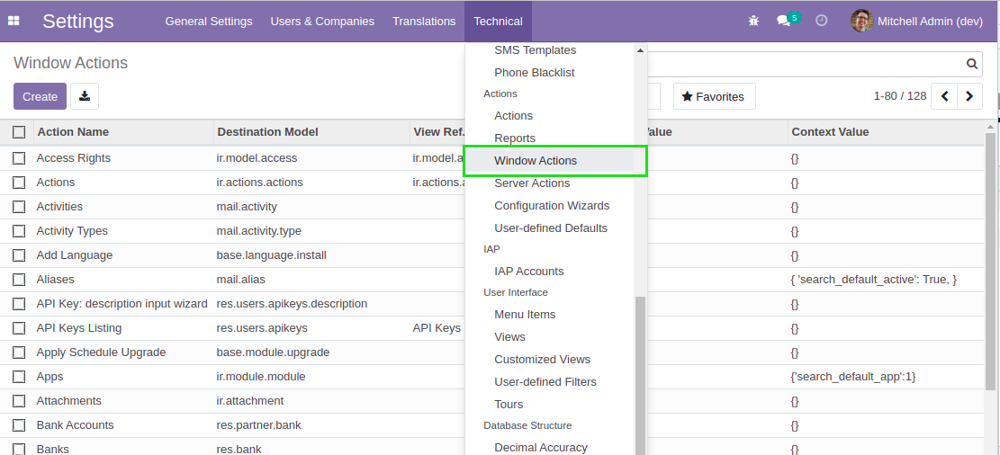
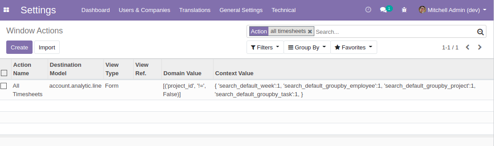
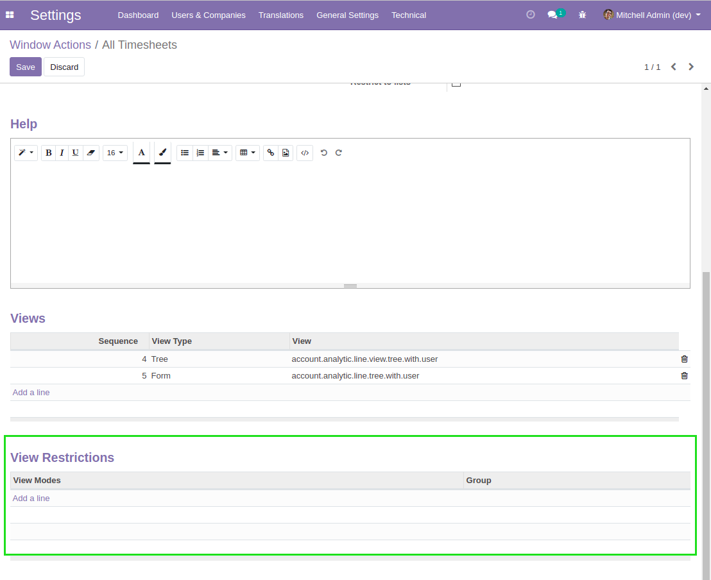
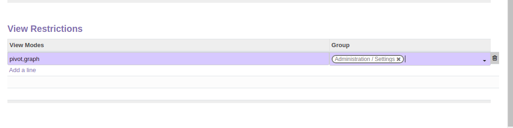
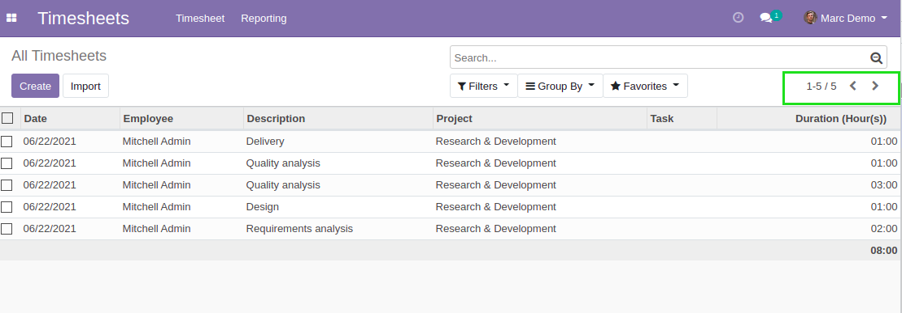
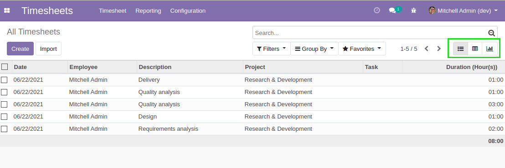

Base View Mode Restricted
=========================
This module allows to restrict the view modes of a given action to a specific group.

.. contents:: Table of Contents

Configuration
-------------
I go to the list of ``Window Actions``.

I select the action view ``All Timesheets``.

In the form view of the action, I notice a new section ``View Restrictions``.

I define a new rule so that only Administrators can see the graph and pivot view types.

..

	The column View Modes must contain the technical names of the view modes to restrict,
	separated by commas.

	If no user group is specified, then the view modes are disabled for everyone.

Usage
-----
Connected as a non-administrator, I go to ``Timesheets > Timesheet > All Timesheets``.

I notice that the pivot and graph views are not available.

Connected as an administrator, I go to ``Timesheets > Timesheet > All Timesheets``.

I notice that the pivot and graph views are available.

Security
--------
This module does not add any real security.

Users without the access to a view mode can find a workaround to access the data.

Contributors
------------
* Numigi (tm) and all its contributors (https://bit.ly/numigiens)
