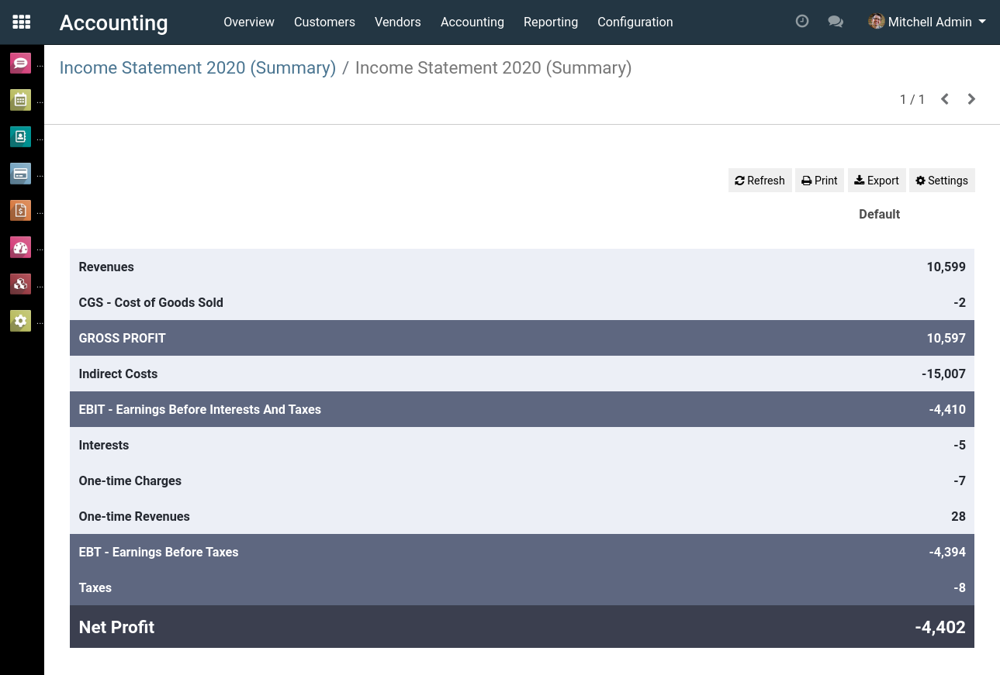
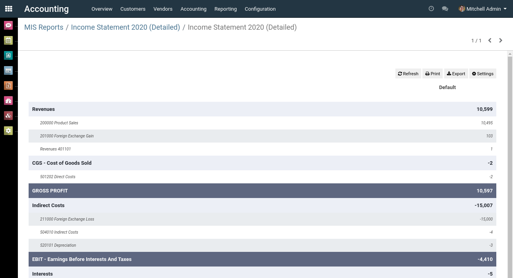
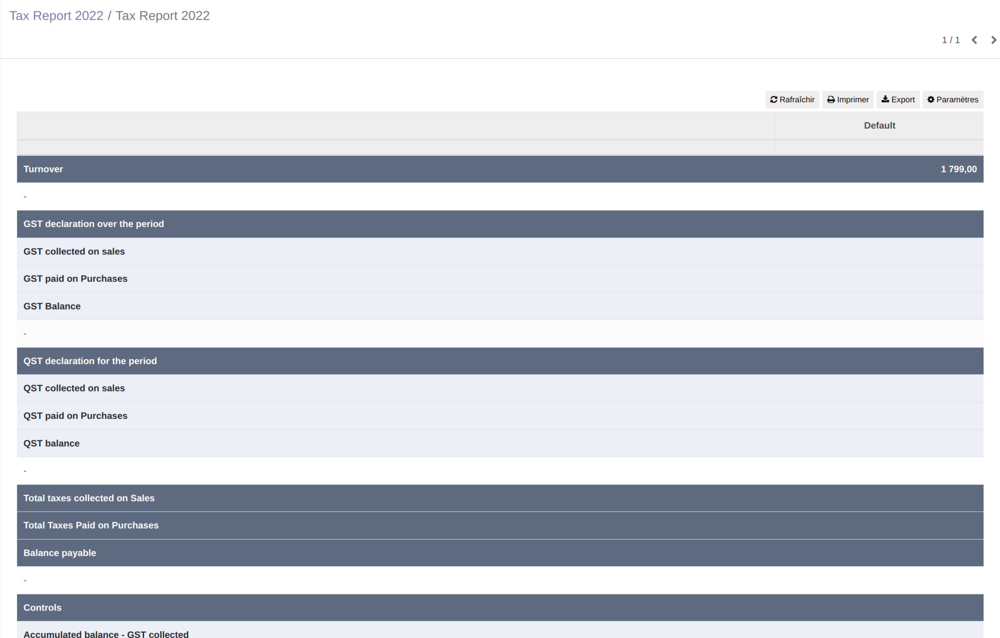
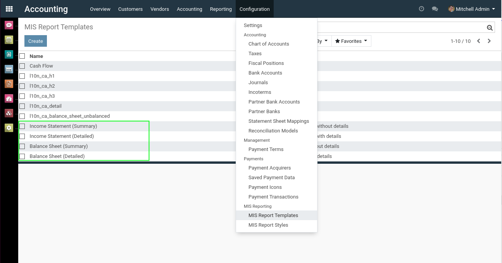

Canada MIS Builder Reports
==========================
This module adds accounting reports based on the mis-builder engine.

.. contents:: Table of Contents

Income Statement
----------------

Balance Sheet
-------------

Detailed Statements
-------------------
Both the balance sheet and the income statement come in 2 different layouts:

* The summary report
* The detailed report

The detailed version is similar to the summary, but each section is detailed per journal account.

Tax Report
----------
Since version 1.0.1, a new report template names "Tax Report" is added to the module.

Customizing the Reports
-----------------------
In production, it is possible to customize the report templates.

When updating the system, any change to these templates will not be overrided.

Contributors
------------
* Numigi (tm) and all its contributors (https://bit.ly/numigiens)

More information
----------------
* Meet us at https://bit.ly/numigi-com
