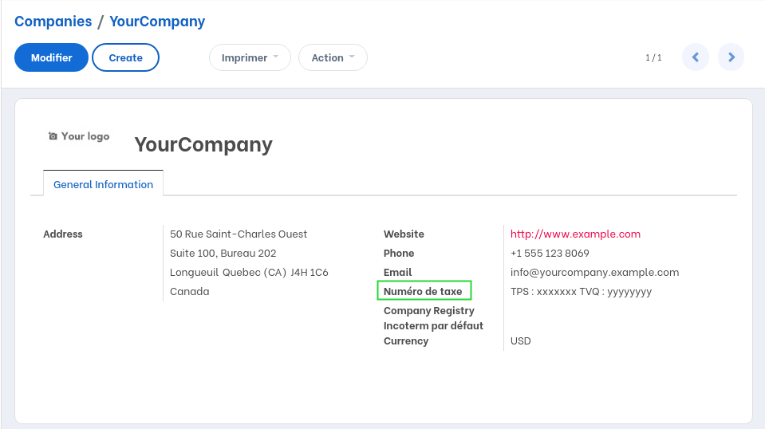
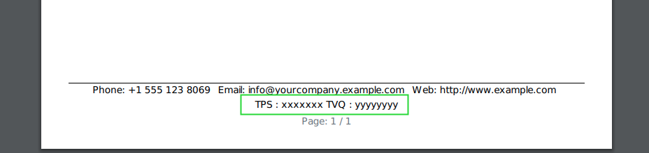

Canada Vat Label
================
This module customizes the ``VAT`` label for Canada.

.. contents:: Table of Contents

Context
-------
Each company in France has a VAT number. VAT means ``Value-Added Tax``.

In Quebec, each company has 2 numbers: ``GST`` and ``QST``.
In Ontario, companies have a single ``HST`` number.

In Odoo, the field ``vat_label`` of res.country allows to define the label for
the equivalent of ``VAT``.

This mecanism does is inadequate in Canada.

Overview
--------
The solution for Canada is to write all numbers in the same field.

The value entered in the field is displayed as is in the footer of external reports.

Contributors
------------
* Numigi (tm) and all its contributors (https://bit.ly/numigiens)

More information
----------------
* Meet us at https://bit.ly/numigi-com
