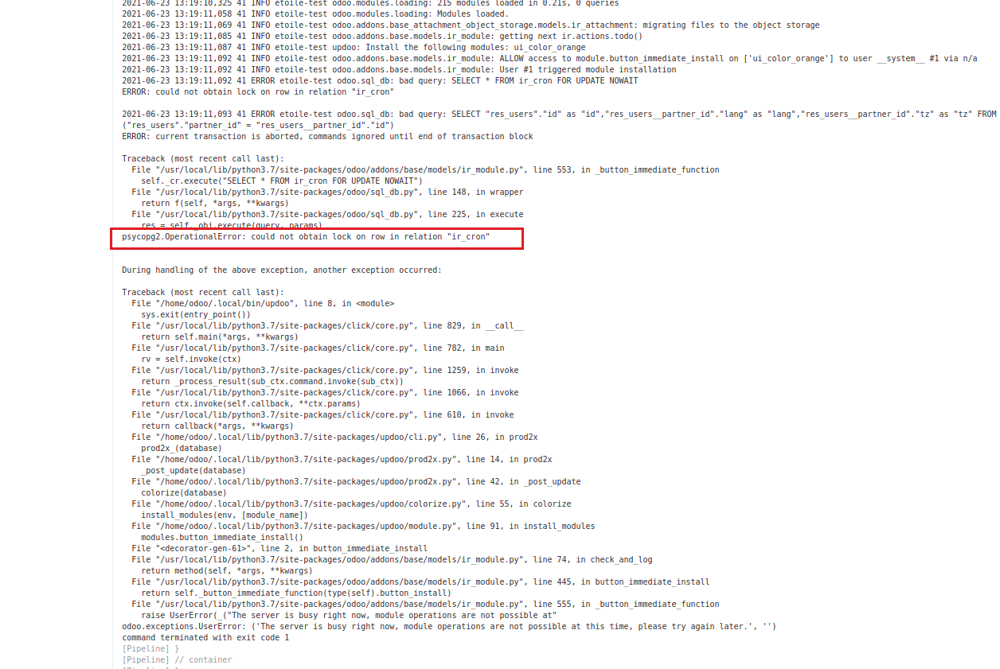
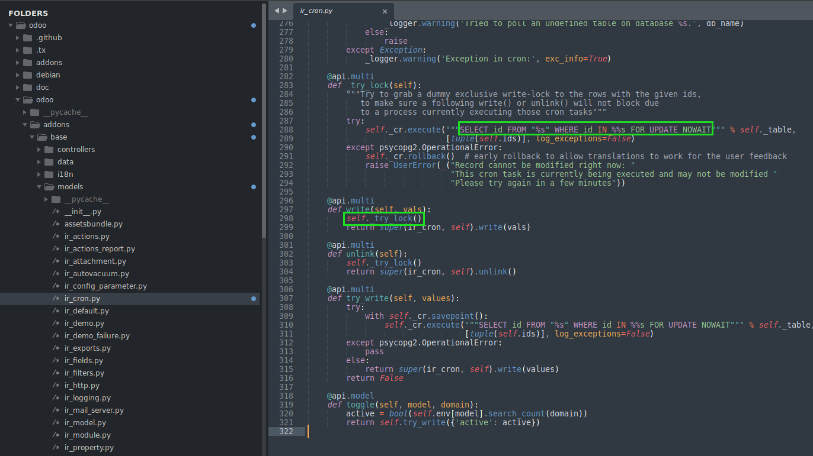

=================
Cron Lock Disable
=================

.. contents:: Table of Contents

Context
-------
When updating modules in an Odoo server, we occasionaly end up with the following blocking error:

This is because, in vanilla Odoo, when writing any value to a ir.cron record, a lock is issued to the database.

Therefore, updating a single module can end up blocking the update of another module.

Summary
-------
This module allows to disable ir.cron locking.

This is done using an environment variable ODOO_CRON_LOCK_DISABLE.

When the environment variable is set, you may update or install your modules without a risk to trigger
a lock to the ir_cron table.

.. code-block:: bash

    export ODOO_CRON_LOCK_DISABLE true
    odoo -u my_module --stop-after-init

Contributors
------------
* Numigi (tm) and all its contributors (https://bit.ly/numigiens)

More information
----------------
* Meet us at https://bit.ly/numigi-com
