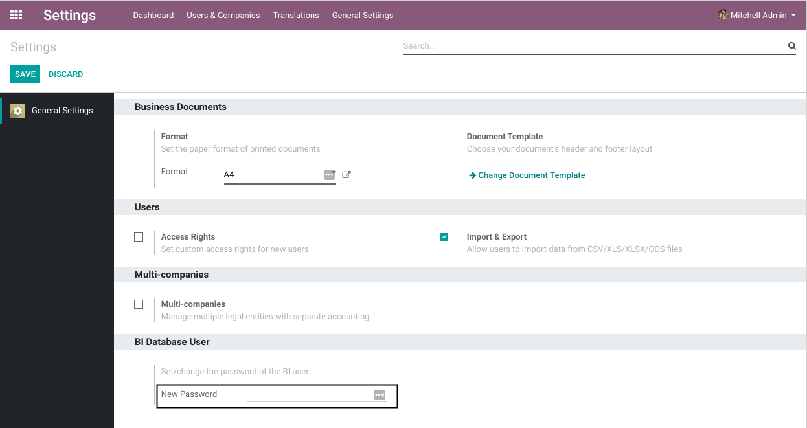
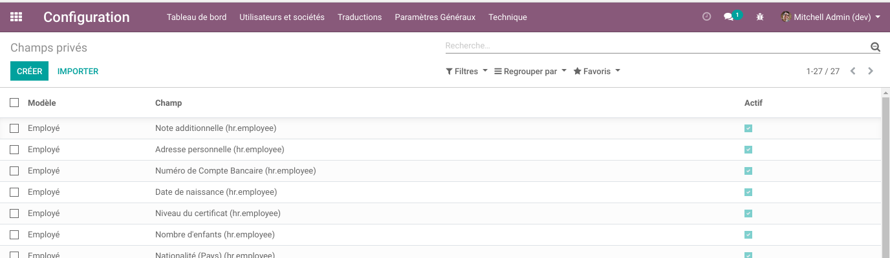

Database BI User
================

.. contents:: Table of Contents

Summary
-------
This module automatically creates a new ``bi`` role for the database.
This role is granted readonly (SELECT) access to all tables.

Password
--------
The password for this role can be set/changed from the web interface.

Private Columns
---------------
Since version ``1.1.0`` of the module, the access to any private column is revoked from the BI user.

When adding or removing a field from this list (through the web interface),
the columns are revoked from the BI user in real time.

Private fields are implemented in the module `private_data_group <https://github.com/Numigi/odoo-base-addons/tree/12.0/private_data_group>`_.

Known Issues
~~~~~~~~~~~~
This feature is only available for fields stored as columns.
The module will not revoke access to relational tables.

Contributors
------------
* Numigi (tm) and all its contributors (https://bit.ly/numigiens)

More information
----------------
* Meet us at https://bit.ly/numigi-com
