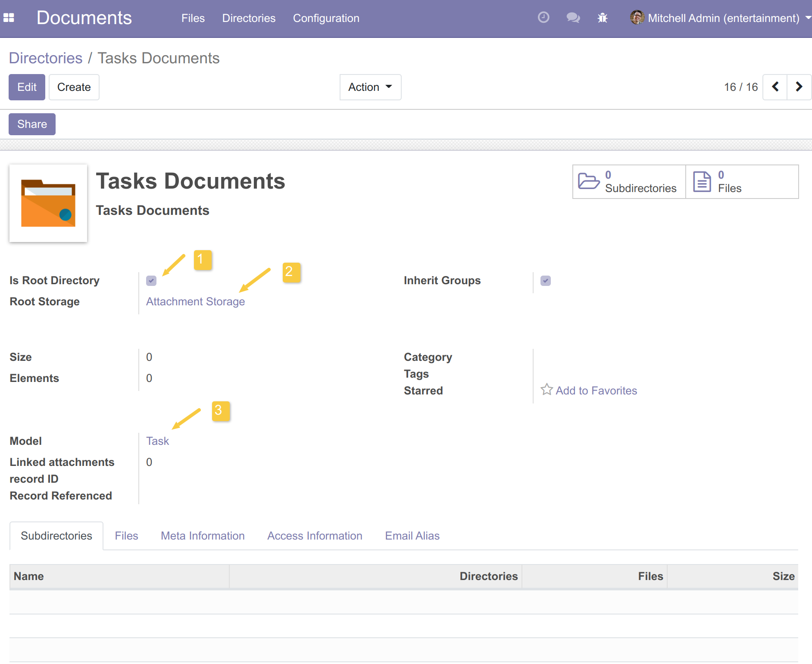
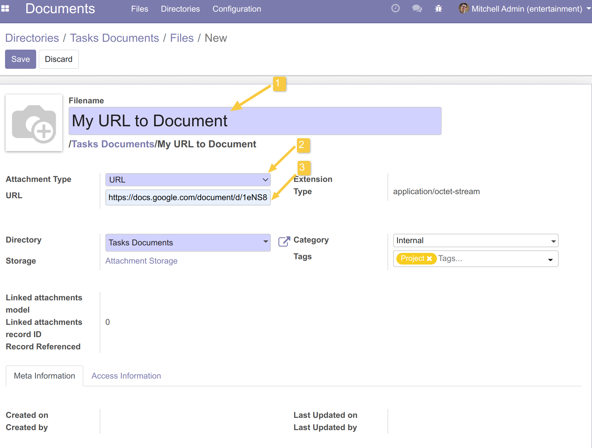
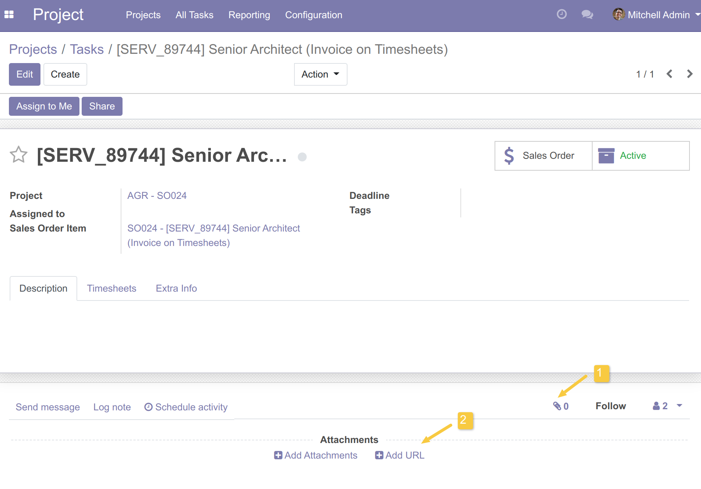
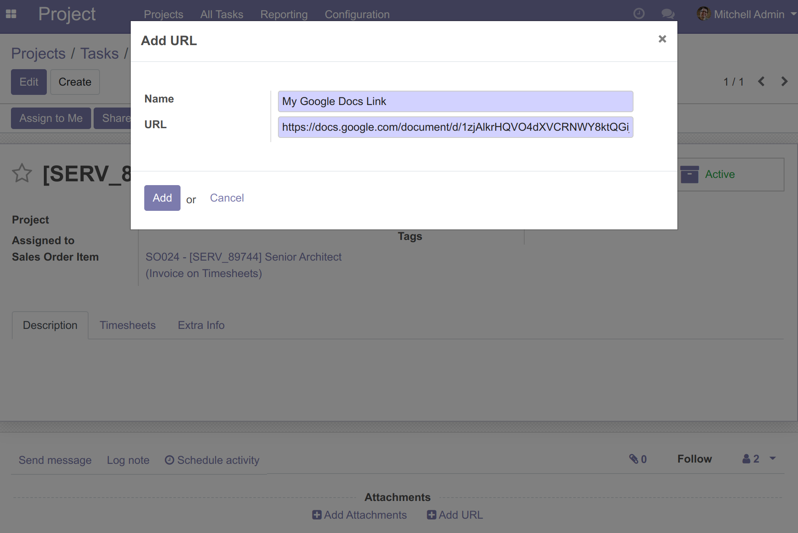
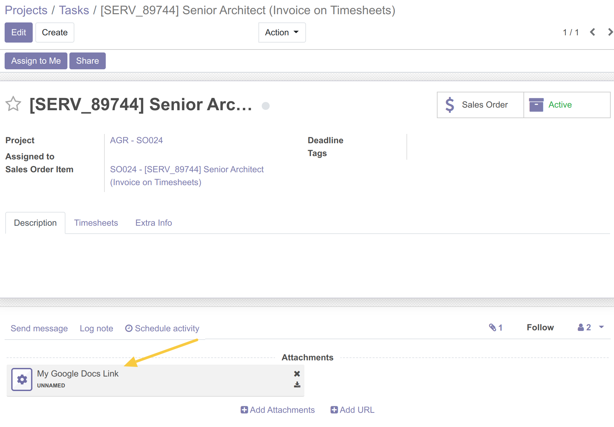
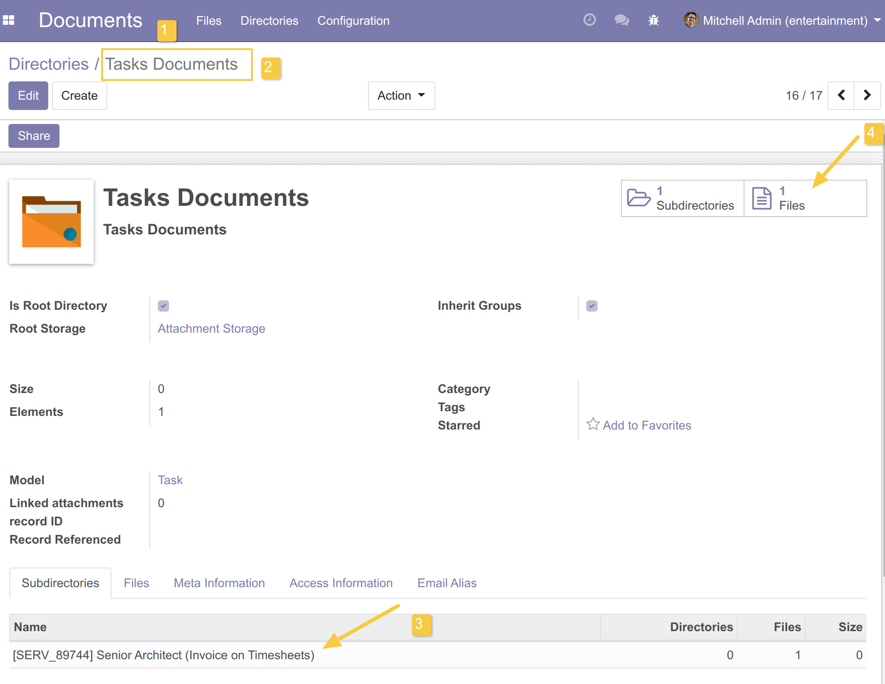
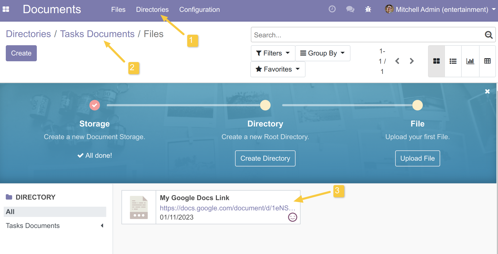

DMS Document URL
================

.. contents:: Table of Contents

Description
-----------
This module is a binding between `dms <https://github.com/OCA/dms/tree/12.0/dms>`_ and `document_url <https://github.com/OCA/knowledge/tree/12.0/document_url>`_. It makes it possible to create URL attachments as documents in DMS.

Usage
-----

From Documents application
~~~~~~~~~~~~~~~~~~~~~~~~~~

I go to Directories and I create the directory `Tasks Documents`.

I check the option `Is Root Directory`, then I choose `Attachments Storage` as a Root Storage for this Directory.

I click in the Smart Button `Files` to create a File in this Directory.

I realize than I can create an attachment of type `URL`.

From any application
~~~~~~~~~~~~~~~~~~~~

I go to the a view then I click on the icon attachment to display options.

I choose `Add URL`.

I enter the name of my document and the URL to this document.

The URL is added to my object as an attachment.

Now I go to the application `Documents`, menu `Directories` and I choose my directory `Tasks Documents` already created.

I can see that the Task is added as a subdirectory to my directory

When I click on the button Files, I can see my attachment of type URL is added to the directory.

Contributors
------------
* Numigi (tm) and all its contributors (https://bit.ly/numigiens)

More information
----------------
* Meet us at https://bit.ly/numigi-com
