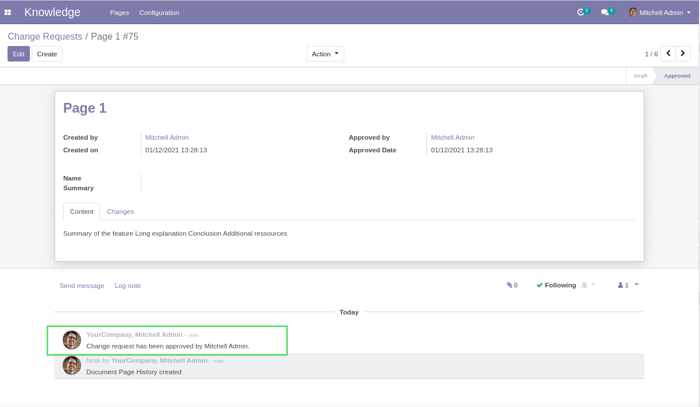
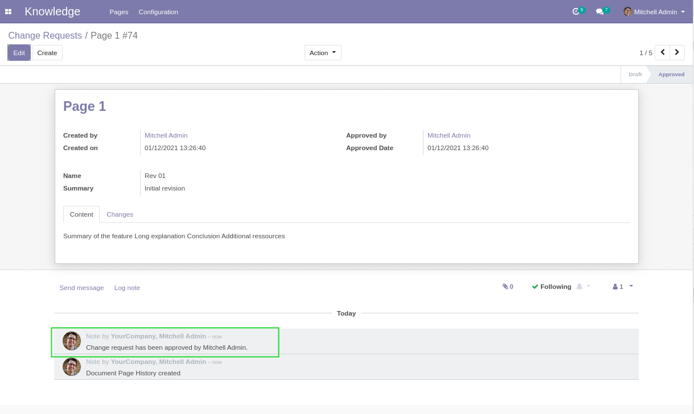

Document Page Approval No Mail
==============================
This module prevents automatic emails sent for the approval of changes to document pages.

.. contents:: Table of Contents

Context
-------
When using the module `document_page_approval <https://github.com/OCA/knowledge/tree/12.0/document_page_approval>`_,
changing a page triggers the creation of a ``Document Page History``.

This triggers a workflow of approval for the change.

In this workflow, automatic emails are sent to the followers of the history record.

Also, in production, some users are mysteriously added as followers of all history records.
For now, no explanation has been found regarding this behavior.

This generates a massive amount of spams in emails.

Overview
--------
After installing this module, the automatic messages logged on the history records
are internal notes, instead of outgoing emails.

Contributors
------------
* Numigi (tm) and all its contributors (https://bit.ly/numigiens)
