Google API Authentication
=========================
This module allows you to set up and connect with Google applications.

It will serve as a base module for other modules to establish connections with Google applications.

This module uses the Google OAuth 2.0 Library for Python.

It also uses OAuth 2.0 for Server-to-Server Applications 
(see documentation here: <https://github.com/googleapis/google-api-python-client/blob/main/docs/oauth-server.md>).

Usage
-----

1- Create a new project in Google Developper Console:
~~~~~~~~~~~~~~~~~~~~~~~~~~~~~~~~~~~~~~~~~~~~~~~~~~~~~

* Log in to your Google Account, go to the `Google Developers Console`, and create a new project.

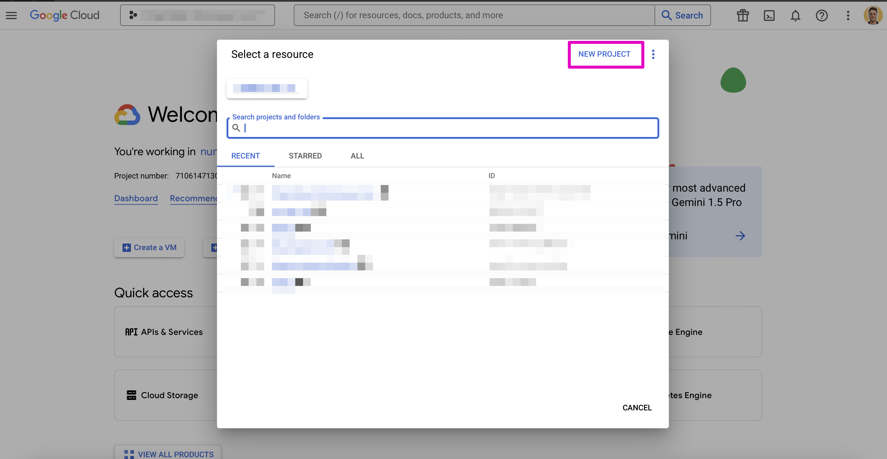

* Fill in the project name field and click on the "Create" button.

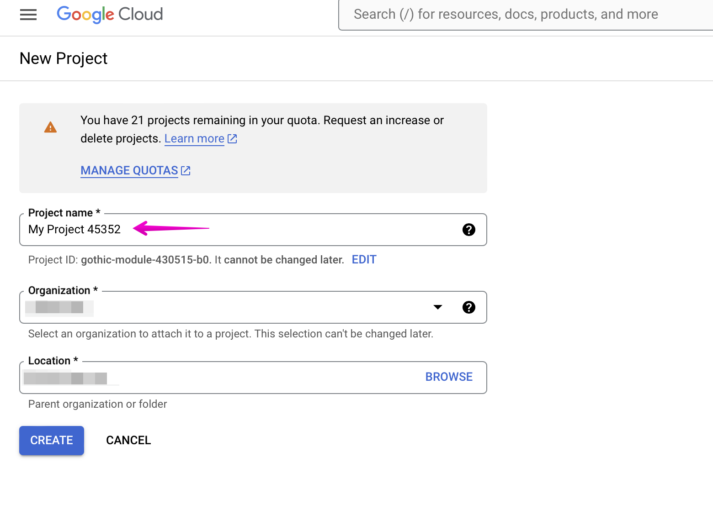

2- Config OAuth Consent
~~~~~~~~~~~~~~~~~~~~~~~

* Go to the OAuth Consent Screen.
* Select the "External" option and click on "Create"

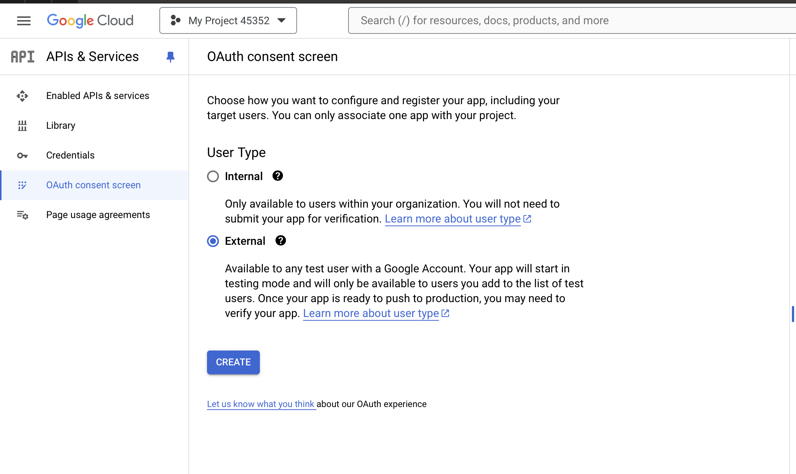

* Fill in all the OAuth consent screen information and click on the "Save and Continue" button.

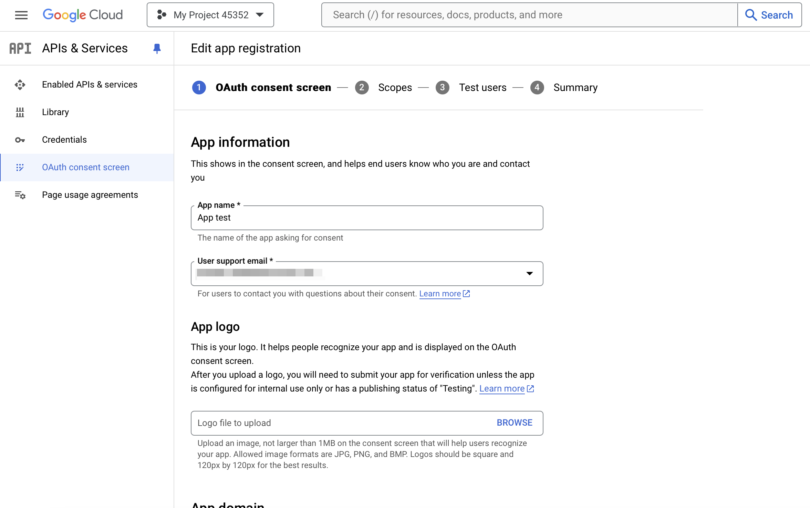

* (2) Set any optional scope options if needed and click on the "Save & Continue" button.
* (3) You may also want to add test users; do so and then click on the "Save & Continue"
* (4) Review all project information, then click on the "Back to Dashboard" button.

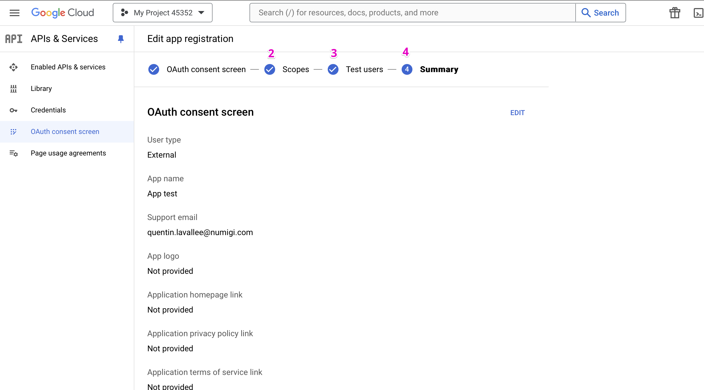

* Click on the "Publish App" button.

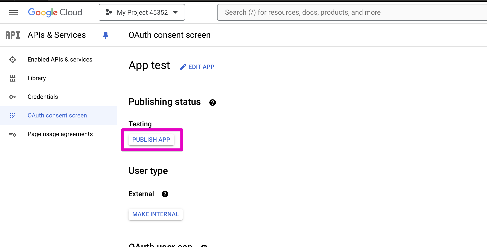

3 - Create credentials account
~~~~~~~~~~~~~~~~~~~~~~~~~~~~~~

* Click on the "Credentials" tab.
* Click on the "Create Credentials" button.
* Select "Service account" from the options.

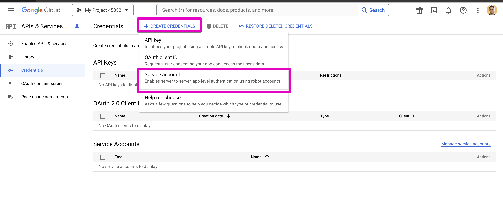

* Fill in the service account name and description, then click on the "Create & Continue" button.

.. image:: static/description/google_api_auth_service_account_info.png

* Grant users access to this service account.
* If needed, grant this service account access to your project as an owner.

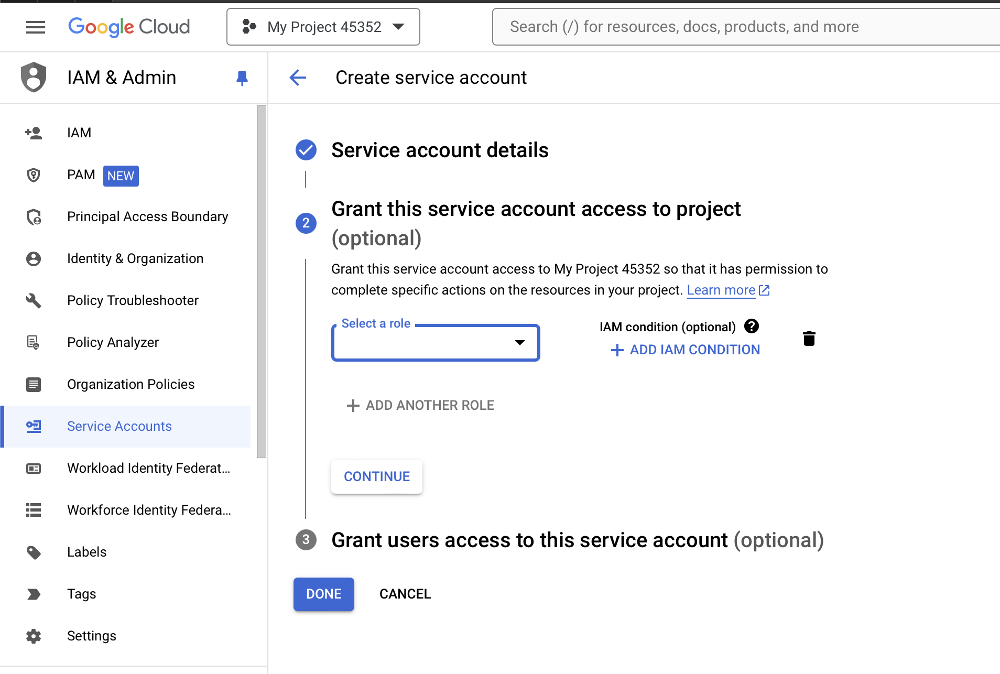

* Download the service account key in JSON and save it in a secure location (you cannot download it again later).

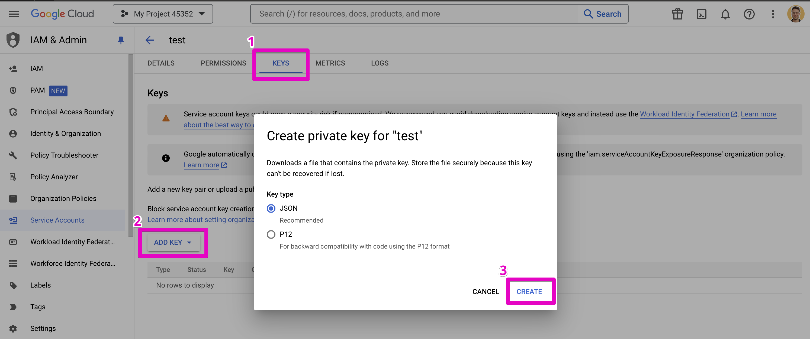

4 - Enable the application API in Google Developer Console
~~~~~~~~~~~~~~~~~~~~~~~~~~~~~~~~~~~~~~~~~~~~~~~~~~~~~~~~~~

* Go to the menu: Settings > APIs & Services > Library.
* Search for the specific API you want to enable (e.g., Google Drive API).

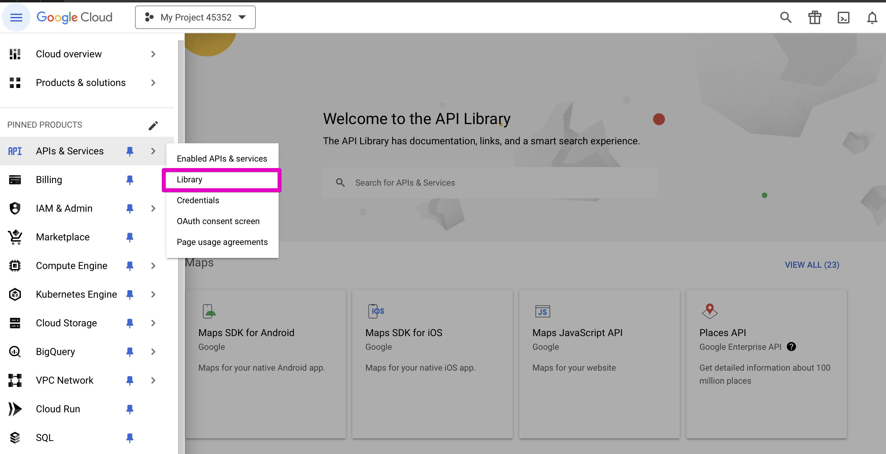

* Click on the API, then click on the "Enable" button.

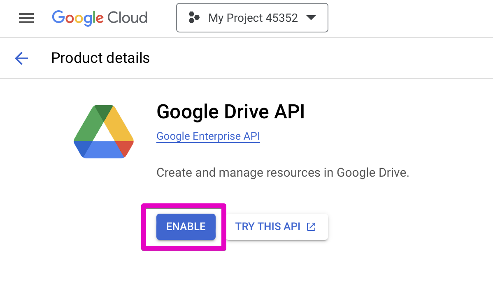

5 - Establish a connection to the Google application
~~~~~~~~~~~~~~~~~~~~~~~~~~~~~~~~~~~~~~~~~~~~~~~~~~~~

* Go to the menu: `Settings > Technical > Google API > Google Applications`.
* Add a Google Applications configuration.

.. image:: static/description/google_app_form.png

* Use the service account type to run API requests.
* For each application, you need to add the scope and the JSON file that contains the authentication key.
* Click on "Test Google API Auth" to check if the authentication is set up correctly.

NB:
~~~

This module can be improved to accommodate other authentication types

Contributors
------------
* Numigi (tm) and all its contributors (https://bit.ly/numigiens)
