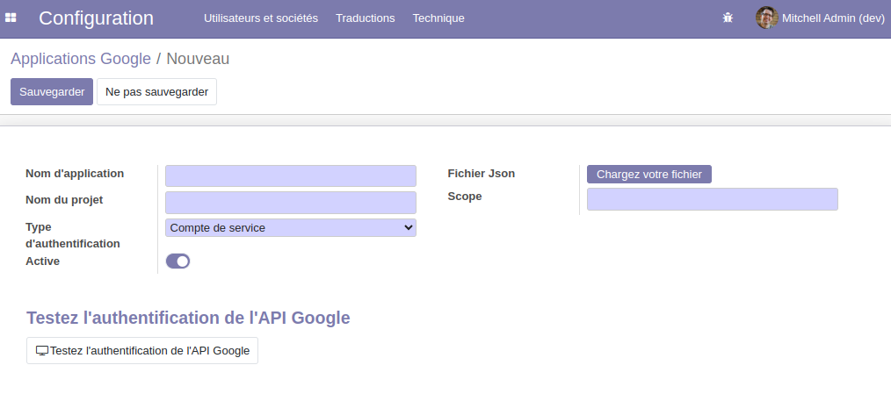

Google API Authentication
=========================
This module allows you to set up and connect Google Applications.
It will serve as a base module for other modules to establish connections with Google applications.
This module uses the Google OAuth 2.0 Library for Python.
It also uses OAuth 2.0 for Server to Server Applications (See documentation `here <https://github.com/googleapis/google-api-python-client/blob/main/docs/oauth-server.md>`_)

Usage
-----

1- Create a new project in Google Developper Console:
~~~~~~~~~~~~~~~~~~~~~~~~~~~~~~~~~~~~~~~~~~~~~~~~~~~~~

- Login to Google Account`, go to `Google Developer Console` and Create new project.
- Fill the project name field and click on `Create` button.

2- Config OAuth Consent
~~~~~~~~~~~~~~~~~~~~~~~

- Go to `OAuth Consent Screen`, Select External option and click on `Click` button.
- Fill the application name field, and select Support email from options.
- Fill the developer support email addresses and click on `Save & Continue` button.
- Set the optional `Scope` options if needed and click on `Save & Continue` button.
- Optional add the test users then click on `Save & Continue` button.
- Review all project information then click on `Back to Dashboard` button.
- Click on `Publish App` button.

3 - Create credentials account
~~~~~~~~~~~~~~~~~~~~~~~~~~~~~~

- Click on Credentials.
- Click on Create Credentials button.
- Select `Service account`.
- Fill the service account name, the description then click on `Create & Continue` button.
- Grant this service account access to project as owner if needed.
- Grant users access to this service account. 
- Download the service account key and save it in a secure place. (You cannot download it again later).

4 - Enable the application API in Google Developer Console
~~~~~~~~~~~~~~~~~~~~~~~~~~~~~~~~~~~~~~~~~~~~~~~~~~~~~~~~~~

5 - Establish connexion to the Googlr application
~~~~~~~~~~~~~~~~~~~~~~~~~~~~~~~~~~~~~~~~~~~~~~~~~

Go to the menu `Settings > Technical > Google API > Google Applications` and add a google applications configuration.

Use the service account type to run API requests.

For each application, you have to add th scope and the Json file that containe the authentification key.

Click on "Test Google API Auth" to check if the Authentication is well set.

Contributors
------------
* Numigi (tm) and all its contributors (https://bit.ly/numigiens)
