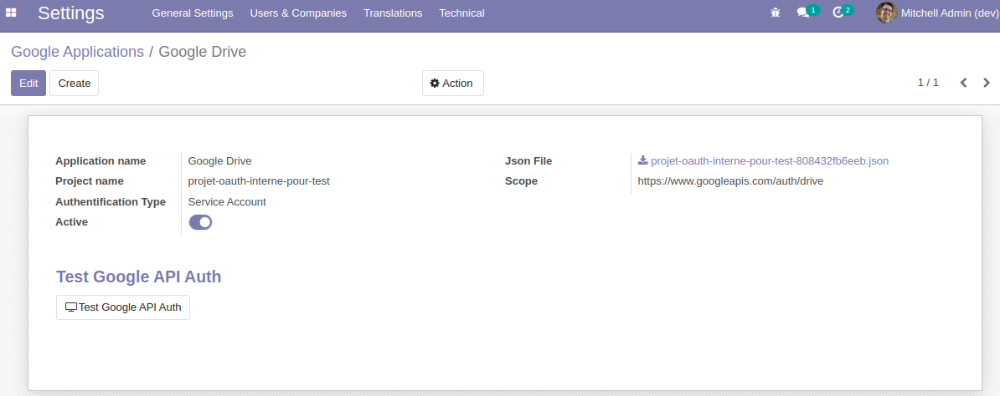

Google API Authentication
=========================
This module allows connect to Google Applications.

Usage
-----

In `Settings > Technical > Google API > Google Applications`, you can set google applications configuration.

Click on "Test Google API Auth" to check if the Authentication is well set.

Contributors
------------
* Numigi (tm) and all its contributors (https://bit.ly/numigiens)
