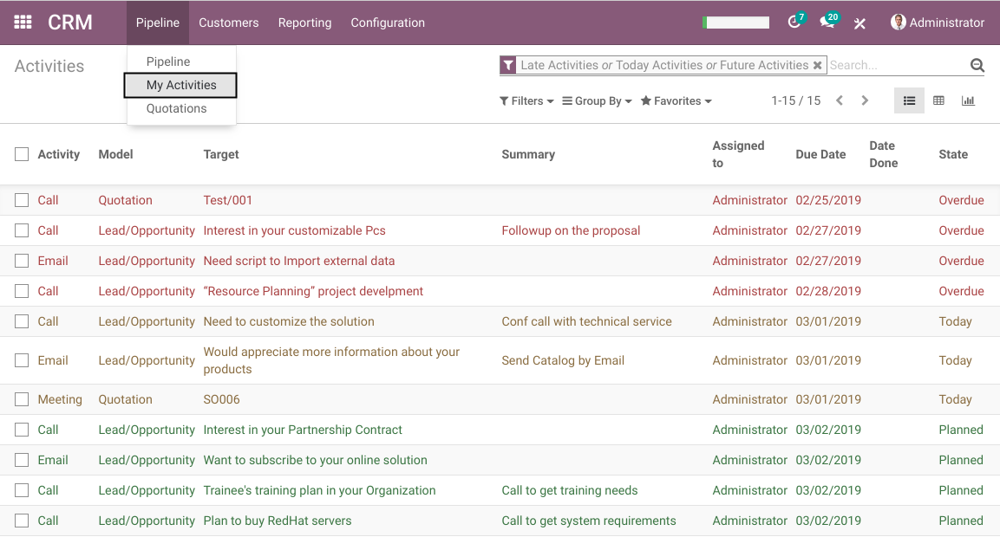
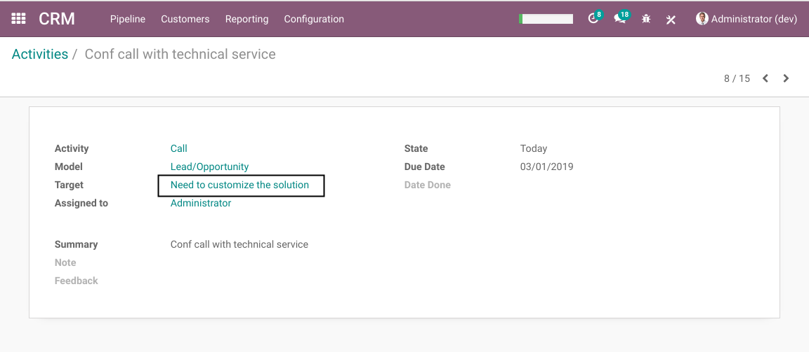
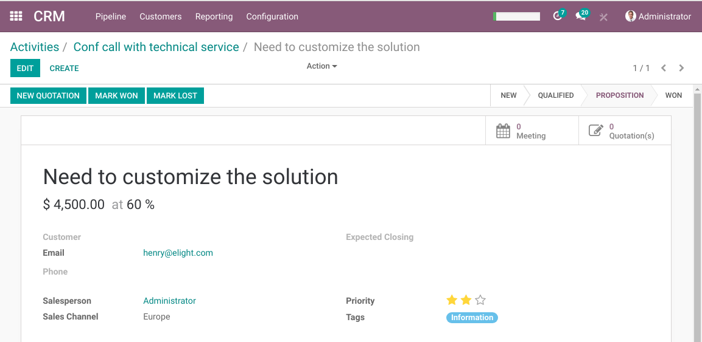
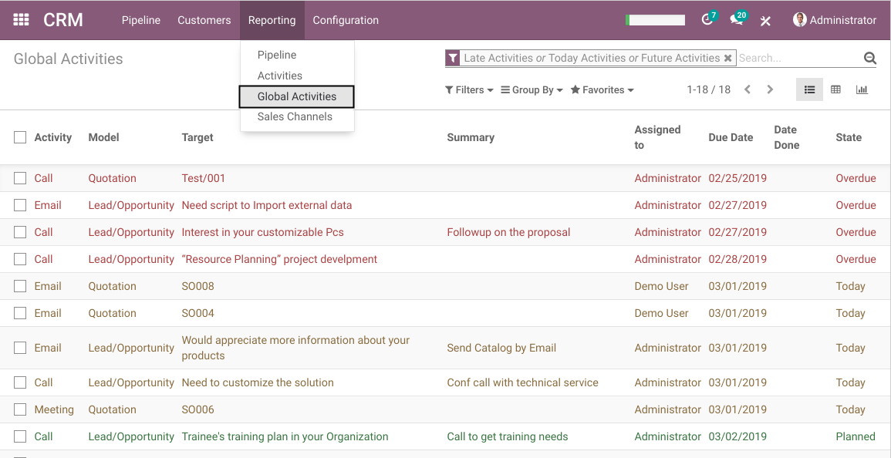
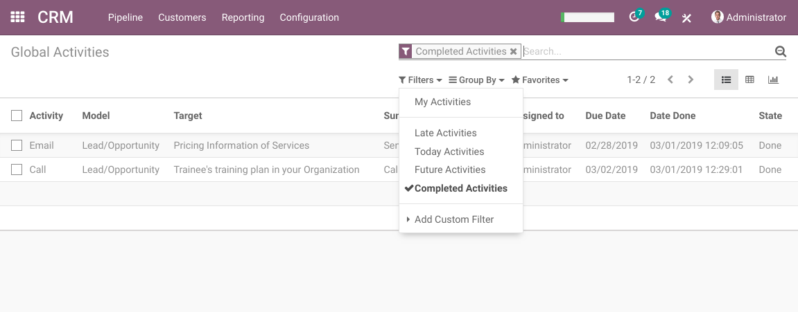

Mail Activity List
==================
This module adds two menu entries in the CRM application to visualize activities.

My Activities
-------------
As member of the group `Sales / User`, under `CRM / My Pipeline`, I find a new menu entry `My Activities`.

This view only shows the acivities assigned to me.
It shows the activities logged in every applications, not only CRM.

If I click on an activity, the form view of the activity is opened.

Then, If I click on the `Target`, the form view of the related record is opened.

Global Activities
-----------------
As member of the group `Sales / Manager`, under `CRM / Reporting`, I find a new menu entry `Global Activities`.

This view is identical to `My Activities`, but shows activities assigned to any user.

Completed Activities
--------------------
By default, both list views only display activities that are not completed.

To display completed activities, click on the `Completed Activities` filter option.

`Completed Activities` is not a standard feature of Odoo. In vanilla Odoo, activities are deleted when completed.
For more details, see the module `mail_activity_not_deleted`.

Contributors
------------
* Numigi (tm) and all its contributors (https://bit.ly/numigiens)
