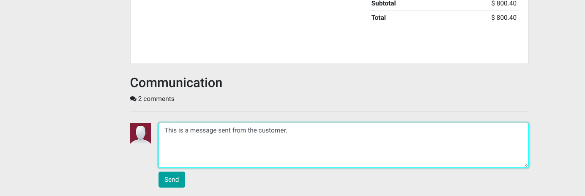
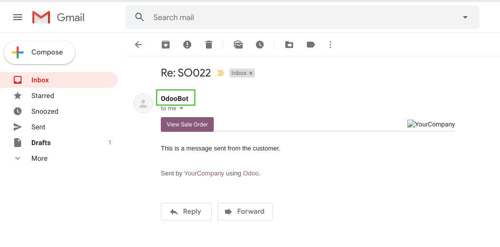
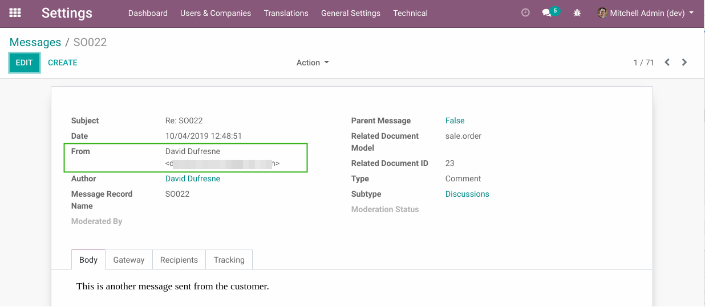
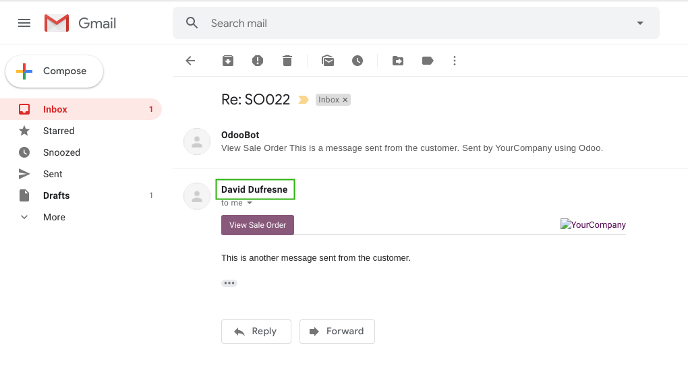

Mail Message From Author
========================

.. contents:: Table of Contents

Context
-------
In vanilla Odoo, when a portal user logs a message through the portal, the email is sent in the name of OdooBot.

Summary
-------
The reason of this behavior is that the ``Author`` field is filled with the portal user, but the ``From``
is left to the default value (``OdooBot``).

.. image:: static/description/mail_message_before.png

After installing this module, whenever a message is created with a given ``Author``, the ``From``
will always be propagated from that author (unless the author has no email in Odoo).

Therefore, when receiving the message in your inbox, the name of the author should be displayed.

Contributors
------------
* Numigi (tm) and all its contributors (https://bit.ly/numigiens)
