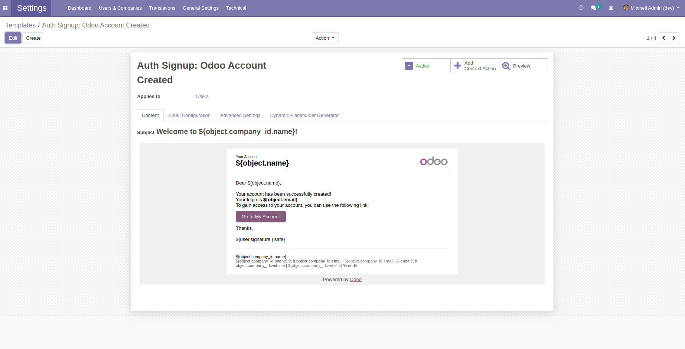
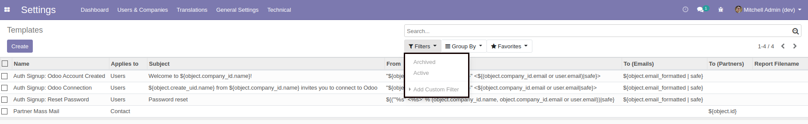

Mail Enable Archive
===================
This module enables the 'Archive' smart button in the view form of a mail template.
Furthermore, it adds two filters in the search view: 'Archived' and 'Active'.

.. contents:: Table of Contents

Form View
----------

The 'Archive' button can be found in the view form of a mail template.

Search View
------------

The 'Archived' and 'Active' filters are in the search view.

Contributors
------------
* Numigi (tm) and all its contributors (https://bit.ly/numigiens)

More information
----------------
* Meet us at https://bit.ly/numigi-com