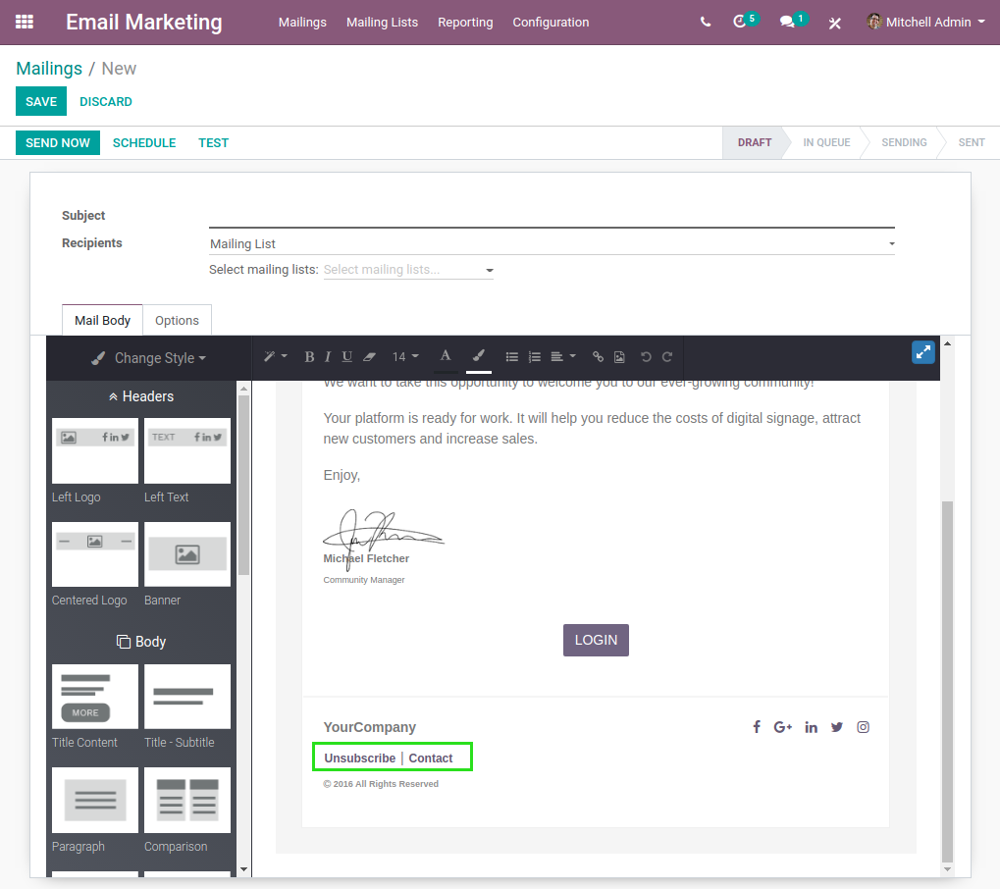

Mass Mailing Unsubscribe From Portal
====================================
This module allows contacts to unsubscribe from mass mailing lists from the portal.

.. contents:: Table of Contents

Context
-------
In vanilla Odoo, inside a mass mailing email template, it is possible to add a link
so that contacts can unsubscribe from the mailing list.

When clicking on the link, the contact is redirected to the unsubscribing page.

.. image:: static/description/unsubscribe_page.png

However, without the link inside the email,
it is not possible for the contact to access this page otherwise.

Usage
-----
As a partner connected to the portal, I notice a new menu entry.

.. image:: static/description/portal_home.png

When I click on the menu entry, the mailing list unsubscribe page is open.

.. image:: static/description/unsubscribe_page.png

Contributors
------------
* Numigi (tm) and all its contributors (https://bit.ly/numigiens)

More information
----------------
* Meet us at https://bit.ly/numigi-com