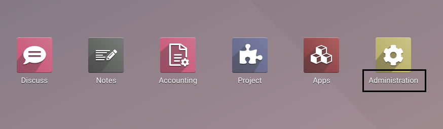

Menu Item Rename
================
This module allows to rename a menu item using XML data files in modules.

Context
-------
Renaming a menu in Odoo directly through the web interface is not a good idea.

* We rapidly loose track of what was modified.
* The menu names are not changed in test environments (except with replication of the prod).
* The changes are lost if someone forces the override of translations.

Usage
-----
Inside an xml file:

* Add a `function` node with model="ir.ui.menu".
* Inside the `function` node, you must set 3 `value` nodes.

  These nodes must have type="char" and respectively contain the following data:

    1. The XML ID of the menu item
    2. The languge code
    3. The new label to set

Here is an example to rename the `Settings` menu to `Administration`.

.. code-block:: XML

    <function name="rename" model="ir.ui.menu">
        <value type="char">base.menu_administration</value>
        <value type="char">en_US</value>
        <value type="char">Administration</value>
    </function>

Here is the result after loading the module containg the XML file.

Contributors
------------
* Numigi (tm) and all its contributors (https://bit.ly/numigiens)
