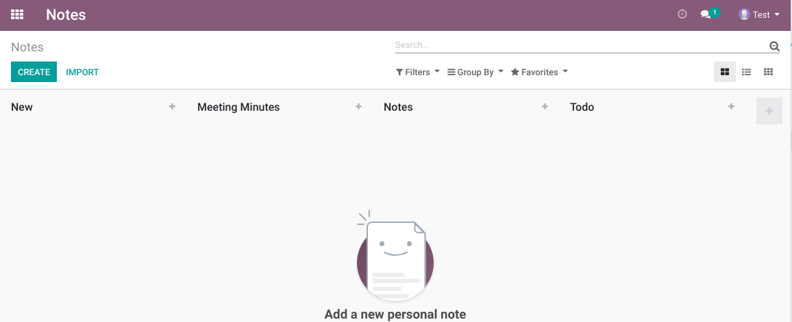
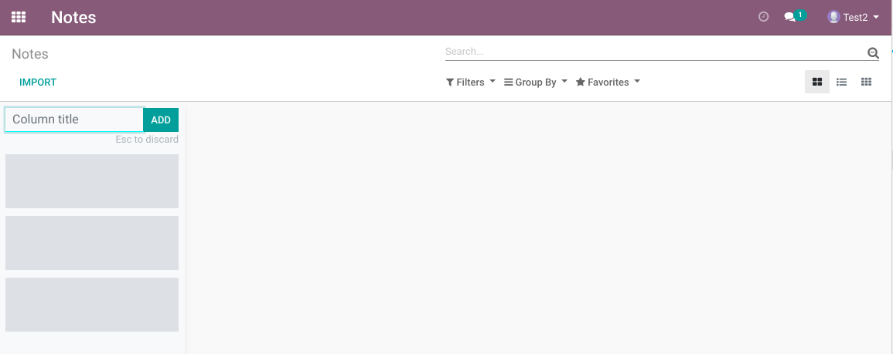

Note No Default Stage
=====================
In vanilla Odoo, the application `Notes` comes with 4 default stages.

This means that as a new Odoo user, if I go to the application `Notes`, I see the following Kanban:

Those default stages are not configurable.

Also, if you are using a multi-lang Odoo instance (i.e. French (CA) is activated),
you may encounter the following error when creating a new user:

``duplicate key value violates unique constraint "ir_translation_model_unique"
DETAIL: Key (type, lang, name, res_id)=(model, fr_CA, note.stage,name, 16) already exists.``

This is because of a bug in the creation of the default stages.

With the module installed, as a new user, I see a kanban view with no default stage.

Contributors
------------
* Numigi (tm) and all its contributors (https://bit.ly/numigiens)
