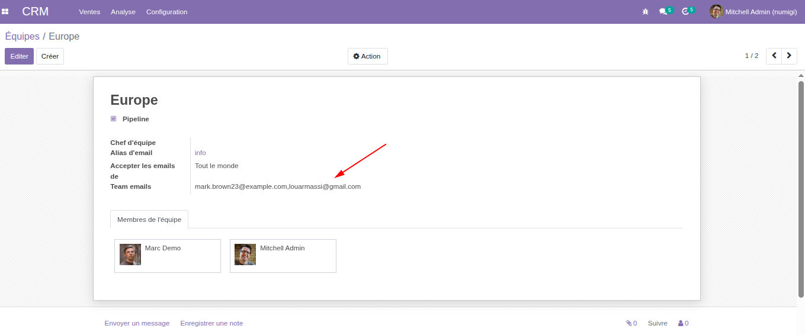
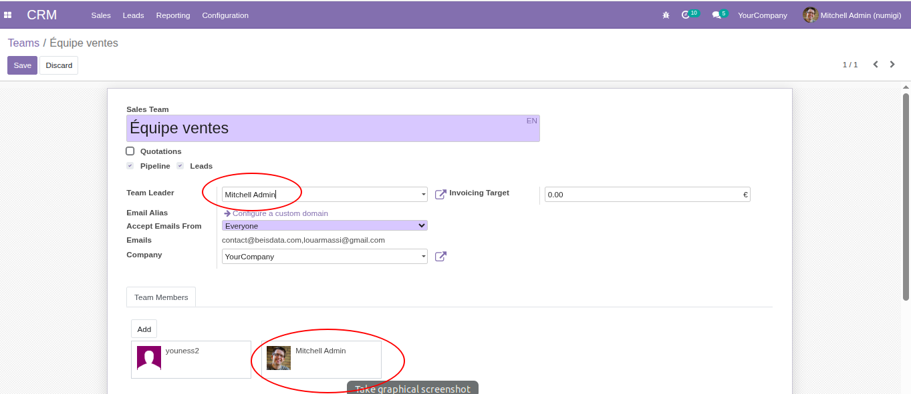
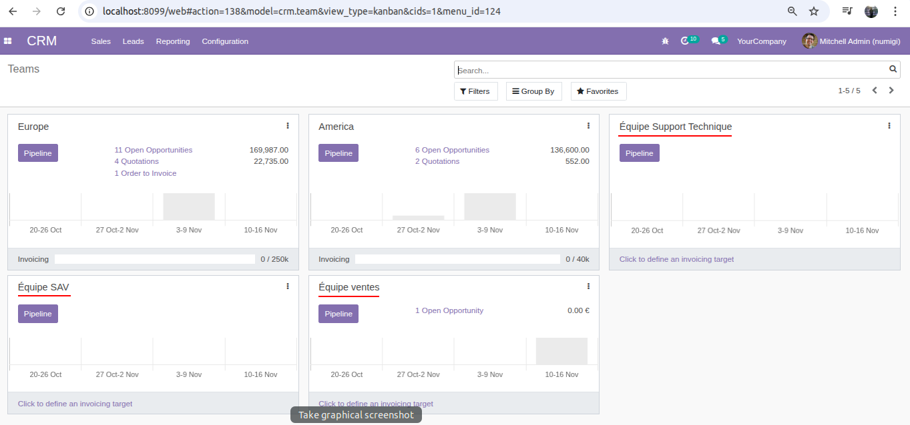
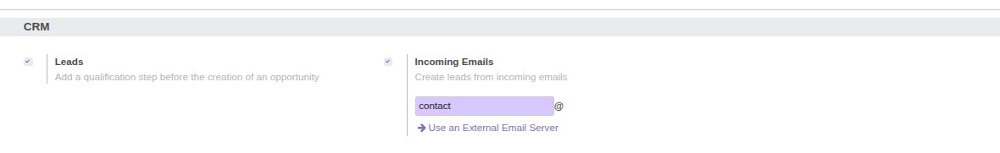
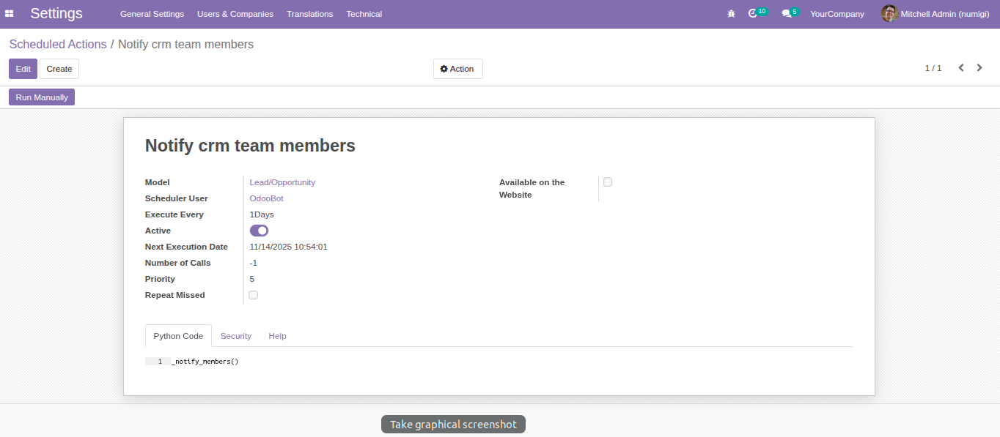

Technical test  ODOO - CRM
==========================
This module add custom features on CRM module

.. contents:: Table of Contents

Context
-------
Custom development on crm and website_crm modules, no configuration will be required after the installation of this module

Overview
--------
A new field is created on crm team form view containing all email addresses of the team members,separated by commas

When the team manager is selected on the team form, it will be automatically added to the team members

Three new teams will be created after the module installation

In the CRM configurator, these two fields will be enabled by default: leads, Incoming emails.

A cron is created to send a notification to the associated members if an opportunity has not progressed beyond the draft stage for more than 10 days.

On all views of leads and opportunities, the “Expected Revenue” field will be visible only to the Sales Administrator group.

On the crm Contact Form from the website, the created lead is assigned to the default Team(Équipe de vente).

Contributors
------------

The `Numigi <https://numigi.com/r/home>`_ team is the contributor to this project. 