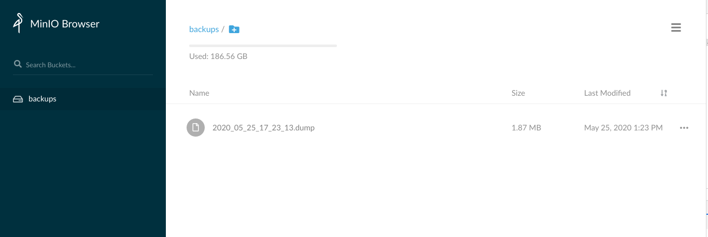
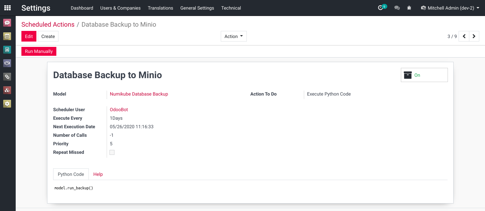

NumiKube Database Backup
========================
This module adds database backup scheduling for the Numigi Kubernetes infrastructure.

Backups are exported to a `minio <https://min.io/>`_ server bound to the same namespace as the Odoo server.
They are stored in a bucket named "backups".

Cron Job
--------
The module adds a new cron job.

This cron can be modified to customize when the backups are executed.

This cron should be deactivated in lab and test environment.
However, it can be ran manually for test purposes.

By default, when creating a new database and installing the module, the cron is deactivated.
It must be activated manually in production.

Module Architecture
-------------------
The module uses the `minio python client <https://docs.min.io/docs/python-client-api-reference.html>`_ to export the backups to the minio server.

The backups are not kept on the Odoo server.
Once the transfer is completed, the backup is deleted from the Odoo server.

The export is always done with the same URL, bucket name and credentials.

* URL: minio:9000
* Bucket Name: backups
* Access Key: minio
* Secret Key: miniosecret
* Secure: False

These values are standardized in order to simplify the overall architecture
and maintenance of the infrastructure.

It also simplifies unit testing.

The minio instances attached to an Odoo instance are never accessible from the internet (0.0.0.0).
Therefore, a custom secret key for each instance is not relevant.

Filestore
---------
The filestore is not exported with the backup. Only the sql dump is exported.

Attachments are directly stored on the minio server using a distinct bucket.
See the module `numikube_attachment_minio`.

Bucket Creation
---------------
When the cron is ran, if the ``backups`` bucket does not exist on the minio server,
it is created automatically.

Contributors
------------
* Numigi (tm) and all its contributors (https://bit.ly/numigiens)

More information
----------------
* Meet us at https://bit.ly/numigi-com
