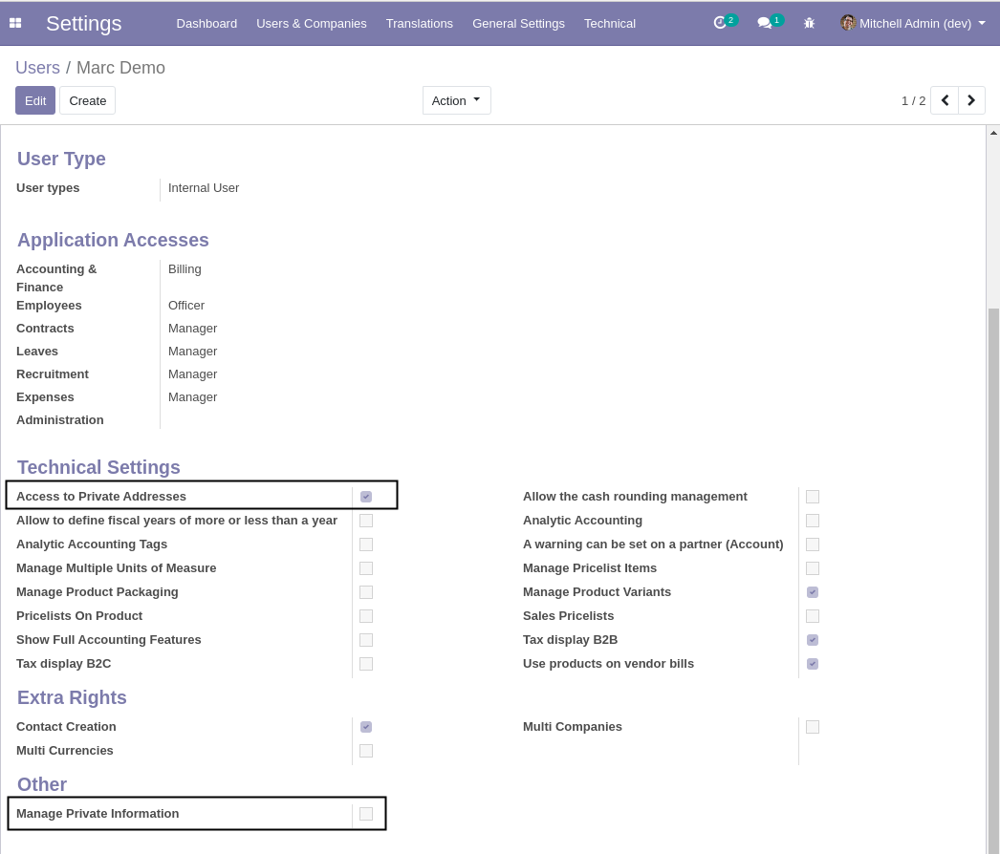
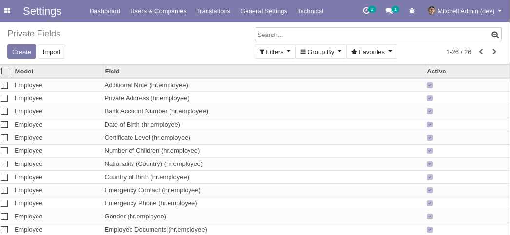

Private Data Group
==================

Odoo Context
------------
In vanilla Odoo, there are basic rules to protect private data:

* Restrictions on partners typed as ``Home Address``.
* Restrictions on fields of the ``Private Information`` tab of an employee.

However, all of the following groups have access to this data:

* ``HR / Officer``
* ``Attendance / Officer``
* ``Gamification / Manager``
* ``Leaves / Officer``
* ``Payroll / Officer``
* ``Recruitment / Officer``
* ``Timesheet / Manager``

Therefore, the restrictions to private employee data is very difficult to reason about
and tightly coupled with each specific application.

Module Design
-------------
Adding extra access rules (either ir.model.access or ir.rule) to protect sensitive employee data would be a bad idea.
This reduces system performance and causes high risks of tracebacks in multiple applications.

Therefore, the module uses another strategy. It blocks direct unauthorized RPC requests to employees and partners.
Any application that internally uses the private data can run without impact.

Manage Private Information Group
--------------------------------
The group ``Access to Private Addresses`` is hidden (it is placed in the ``Technical Settings`` category).

A new group ``Manage Private Information`` is added.

Private Address Rule
--------------------
The existing ir.rule to restrict access to partner addresses is deactivated.
A new equivalent rule is added based on `Base Extended Security <https://github.com/Numigi/odoo-base-addons/tree/16.0/base_extended_security>`_.

This rule has the same restricted domain, but is bound to the new group ``Manage Private Information``.

The benefit of this mecanism is that it does not impact the internal behavior of Odoo.
It applies restriction on direct rpc requests to the given object.

Private Fields
--------------
The module adds a list of ``Protected Fields`` accessible from ``Settings / Technical / Security``.

This list allows to dynamically add fields that should be restricted to the group ``Manage Private Information``.
By default, this list contains the fields of the ``Private Information`` tab of an employee.

Fields of other models can be added as well (hr.applicant, res.partner, etc).

When a field is protected, it is automatically removed from views containing it (if the user is unauthorized).

Contributors
------------
* Numigi (tm) and all its contributors (https://bit.ly/numigiens)
