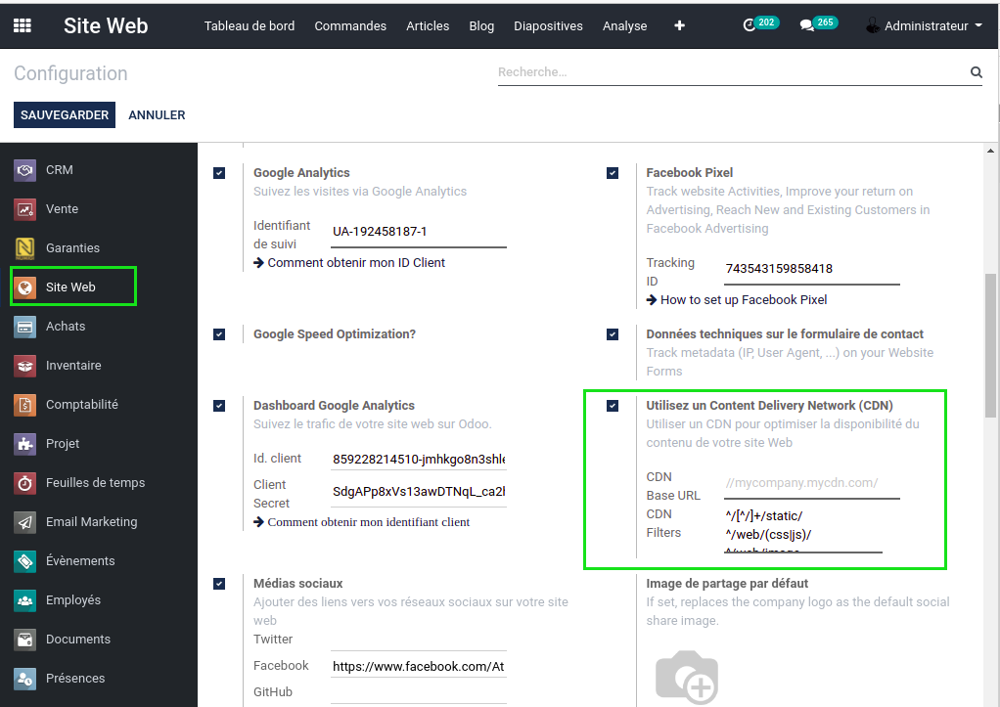
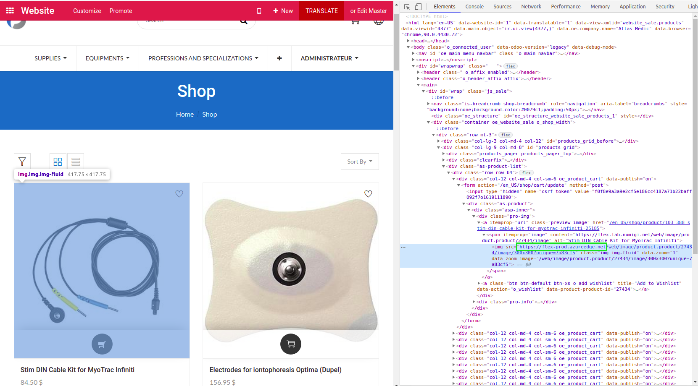
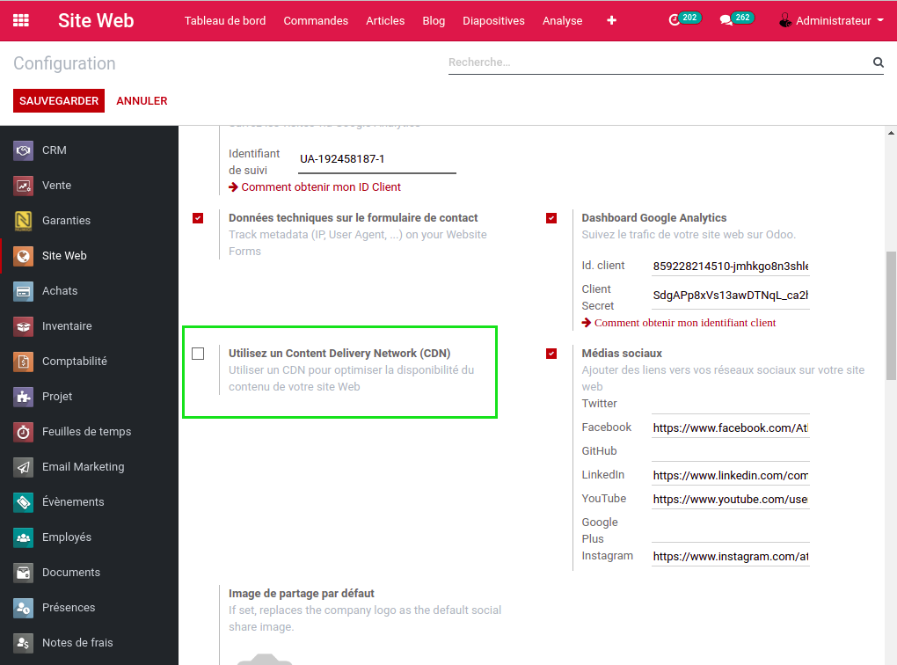

Prod2x CDN Deactivation
=======================

.. contents:: Table of Contents

Context
-------
In Odoo, you can define a CDN in the settings of the website application.

This CDN is used on the website to distribute images and other static assets.

However, the CDN should be unique per Odoo instance.

Otherwise, some assets (such as css and javascript files) will be missing
because they are unique per Odoo instance.

Summary
-------
This module extends the module ``prod2x``.

It deactivates the CDN for staging environments.

Usage
-----
After running a prod2x, I notice that the CDN was deactivated.

Contributors
------------
* Numigi (tm) and all its contributors (https://bit.ly/numigiens)

More information
----------------
* Meet us at https://bit.ly/numigi-com
