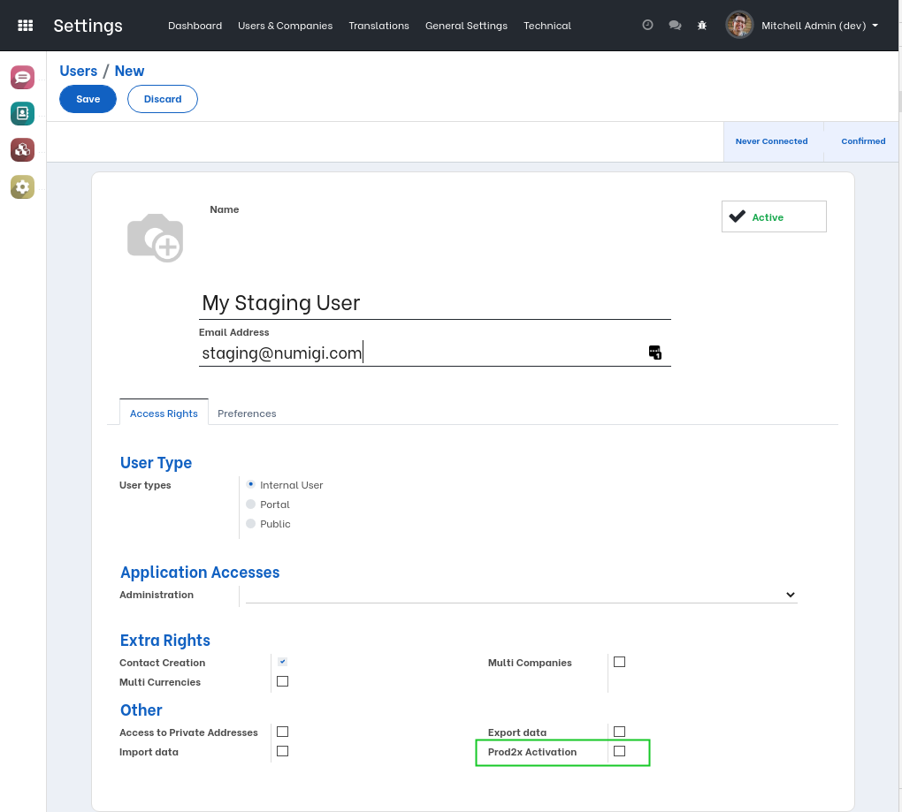
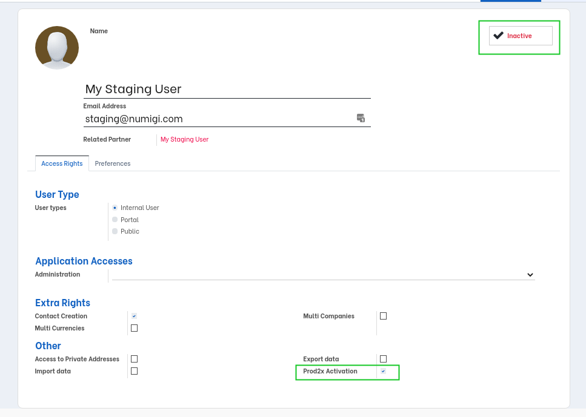
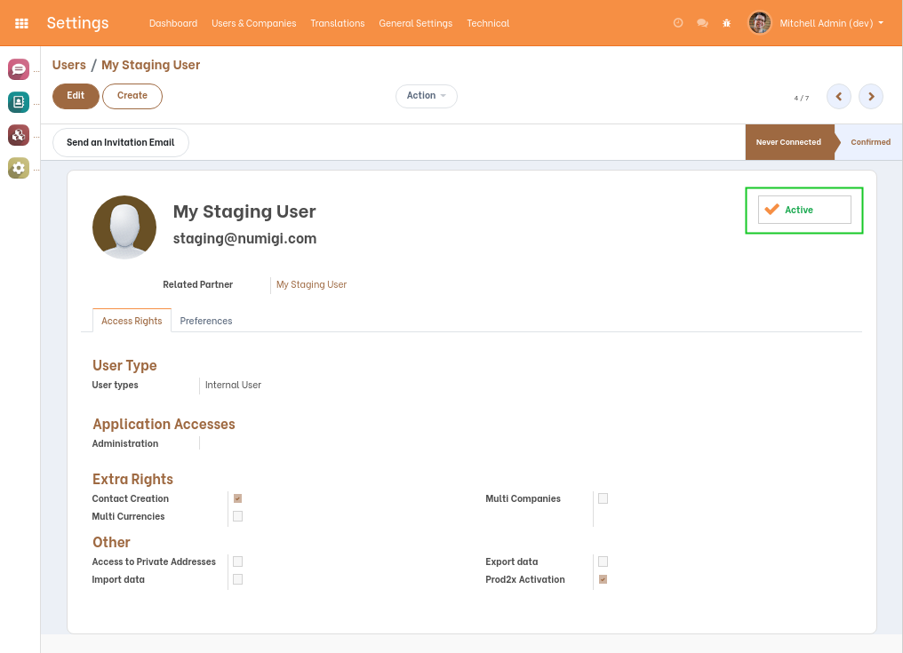

Prod2x User Activation
======================

.. contents:: Table of Contents

Context
-------
When testing on a staging environment, the people who test the features and bug fixes likely require more advanced user access
then what they have in production.

However, it is not a good practice to share the ``Admin`` user with everyone.

A better way is to create extra users for the people who test.
These users are archived in production and activated in staging environment.

Summary
-------
This module extends the module ``prod2x``.

It allows to activate some archived users when creating a staging database.

Usage
-----
I create a new user in production.

I notice a new checkbox ``Prod2x Activation``.

I check this box and I archive the user.

In my staging environment, I notice that the user is automatically activated.

Contributors
------------
* Numigi (tm) and all its contributors (https://bit.ly/numigiens)

More information
----------------
* Meet us at https://bit.ly/numigi-com
