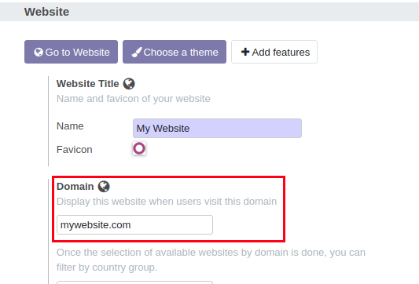
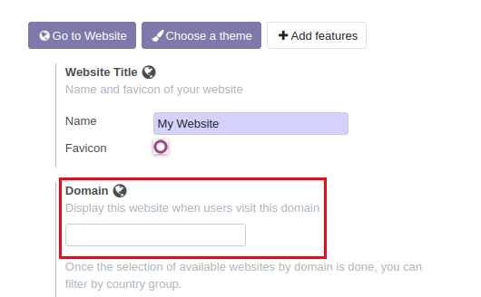

Prod2x Website Domain Deactivation
==================================
This module deactivates the website domain upon lab or test instance creation. 

Usage
-----
Websites have a domain name.

Upon lab or test instance creation, the website domains will be deactivated.

Contributors
------------
* Numigi (tm) and all its contributors (https://bit.ly/numigiens)

More information
----------------
* Meet us at https://bit.ly/numigi-com
