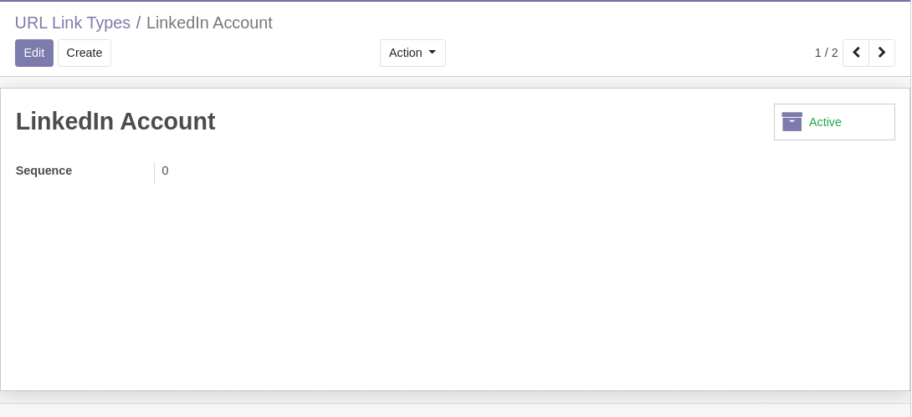

URL Link Types
==============
This module adds types of URL links as an Odoo model.

This new model can be used in specific applications.

The module defines a list view and a form view for link types.

.. image:: static/description/url_link_type_list.png

Known Issue
-----------
However, it does not define a menu entry for configuring these.
We suggest to add a proper menu entry in a specific application.

Contributors
------------
* Numigi (tm) and all its contributors (https://bit.ly/numigiens)
