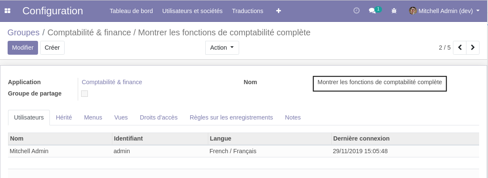
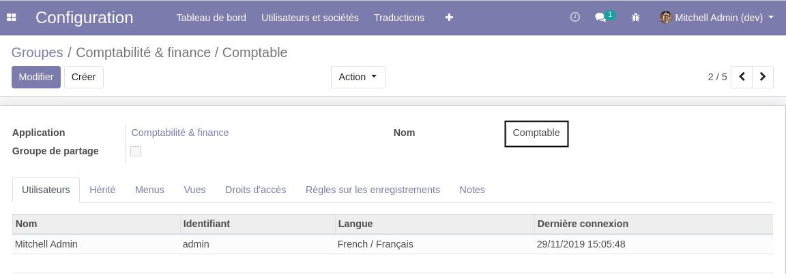

User Group Rename
=================
This module allows to rename a user group using XML data files in modules.

This module is the same as ``menu_item_rename`` but for user groups instead of menu items.

Usage
-----
Here is an example of usage in an XML file.

.. code-block:: XML

    <function name="rename" model="res.groups">
        <value type="char">account.group_account_user</value>
        <value type="char">fr_FR</value>
        <value type="char">Comptable</value>
    </function>

Before loading the XML, the group is named ``Montrer les fonctions de comptabilité complète`` in french.

After loading the XML, the group is named ``Comptable``.

Contributors
------------
* Numigi (tm) and all its contributors (https://bit.ly/numigiens)
