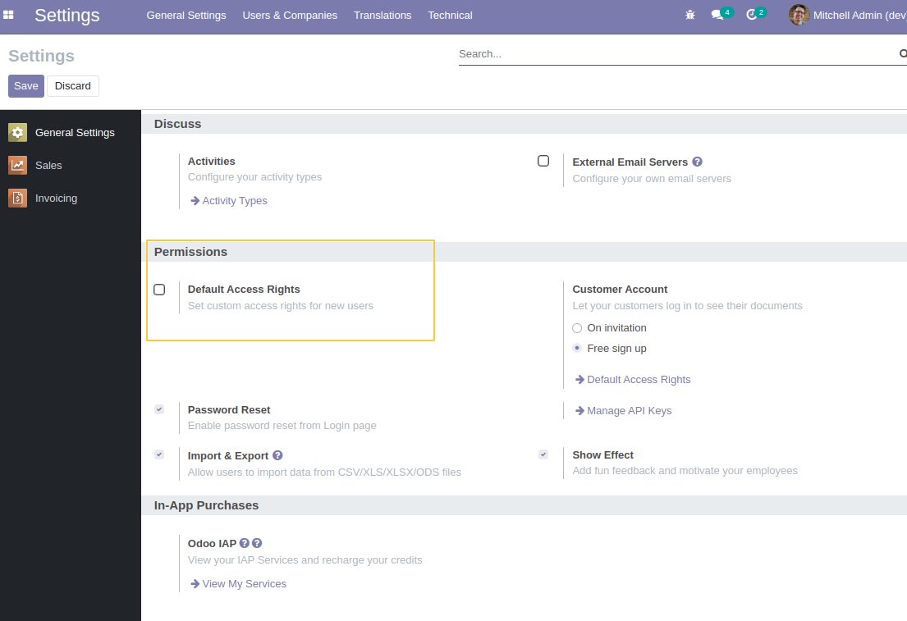
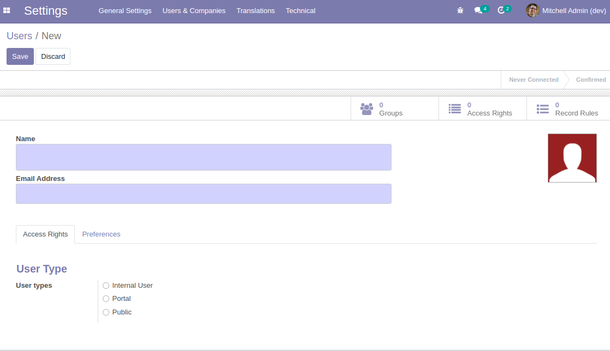

Users Default Groups
====================

In Odoo Vanilla, when we create a new user, the default groups will be added to 
the user even if we have the parameter "Default Access Rights" unchecked.

This module fixes this behavior to not set default groups to a new-created user 
if the parameter "Default Access Rights" is not checked.

Usage:
------

As a user with the "Administration/Settings" group, I go to the `General Settings` 
and verify if the parameter "Default Access Rights" is unchecked.

Then I go to the `Users & Companies` menu and create a new user.
I can see that there are no groups added by default.

Contributors
------------
* Numigi (tm) and all its contributors (https://bit.ly/numigiens)
