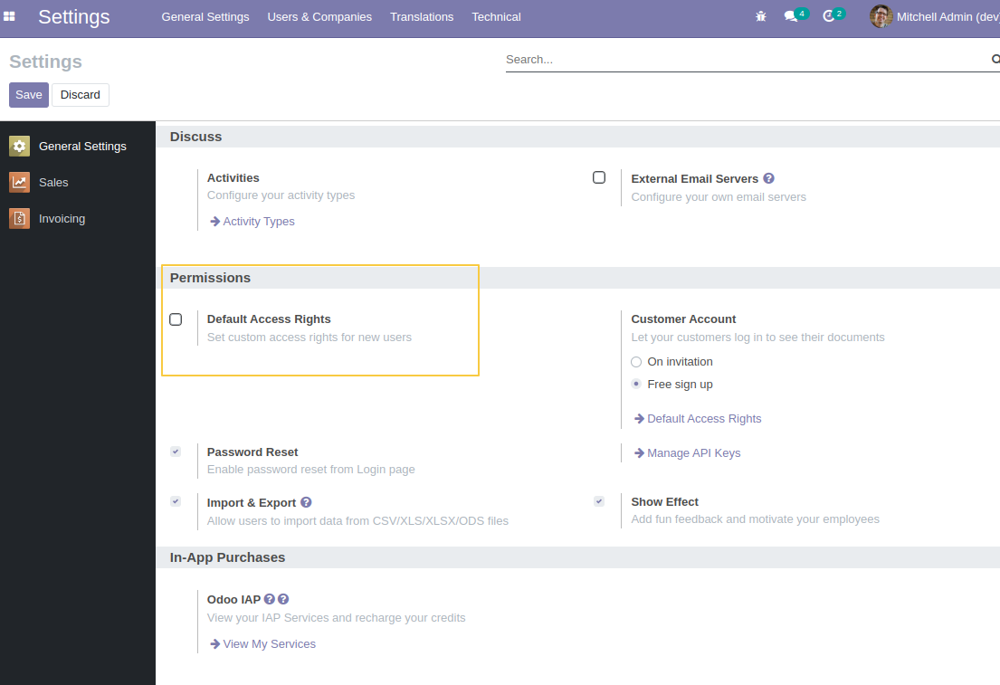
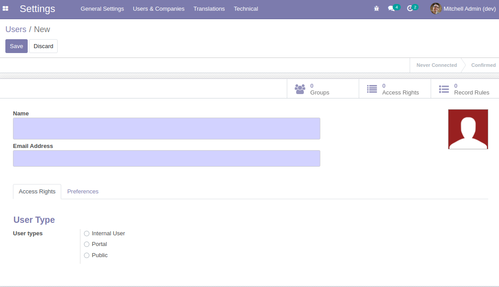

Users Default Groups
====================

In Odoo Vanilla, when we create a new user, the default groups will be added to 
the user even if we have the parameter "Default Access Rights" unchecked.

This module fixes this behavior to not set default groups to a new-created user 
if the parameter "Default Access Rights" is not checked.

Usage:
------

As a user with the "Administration/Settings" group, I go to the `General Settings` 
and verify if the parameter "base_setup.default_user_rights" is set to 1 or 0 (1 for enabled and 0 for disabled).
By default, if the parameter is missing, it will be known as 0.

If the parameter is set to 0, I proceed to create a new user without any default groups.
The user will be as only an internal user without any groups.

Then I go to the `Users & Companies` menu and create a new user.
I can see that there are no groups added by default.

Contributors
------------

The `Numigi <https://numigi.com/r/home>`_ team is the contributor to this project. We help Quebec companies implement Odoo and Konvergo ERP.
