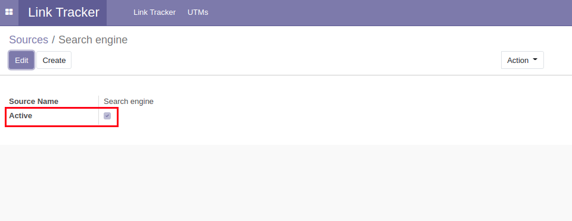
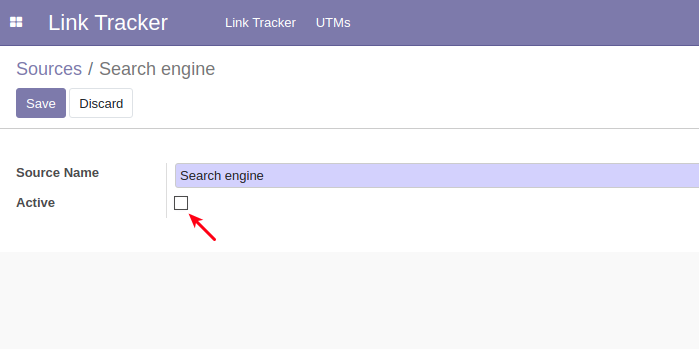
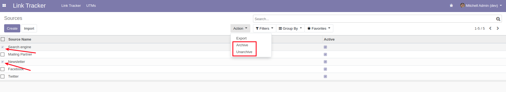

Utm Archive
===========
This module allows campaign and source archiving.

.. contents:: Table of Contents

Summary
-------
This module adds a new active selection to campaigns and sources.

You can change this field by either ticking or unticking the box in the form view.

You can also change that field on multiple campaigns or sources by using the archive/unarchive action button.

Configuration
-------------
No configuration is required beyond installation.

Contributors
------------
* Numigi (tm) and all its contributors (https://bit.ly/numigiens)
