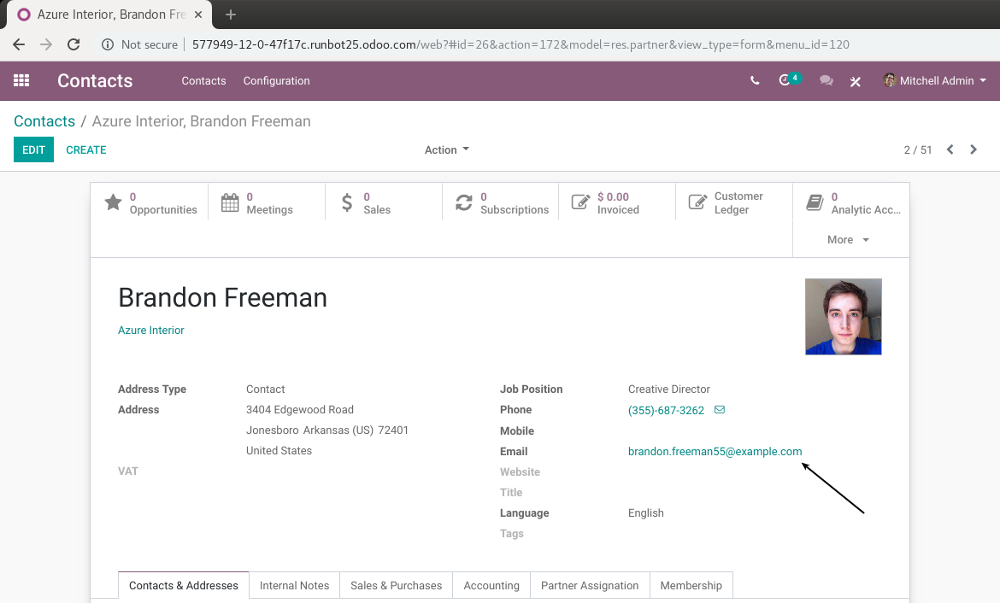
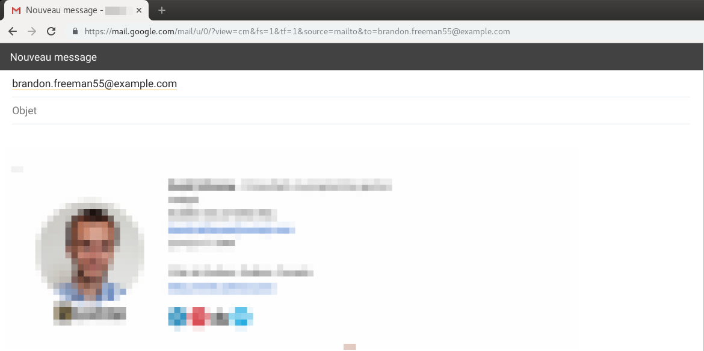
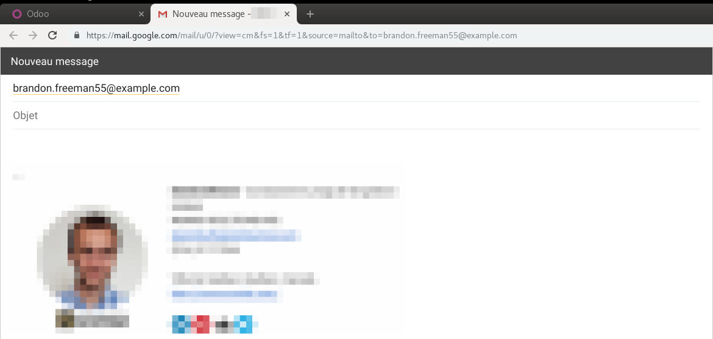

Web Email Field New Tab
=======================
In standard Odoo, when clicking on an email, the email manager is opened in the current window.

After installing the module, when clicking on an email address, the email manager
is opened in a new tab.

Contributors
------------
* Numigi (tm) and all its contributors (https://bit.ly/numigiens)
